# Meme destesi: bağlamlar, kareler ve H3 Max komutları

Her meme için seçilen kare, videonun kendisi (konuşma metni ve kareler) ya da fotoğraf, internetteki anlamı ve oylamada kazanınca Director'a giden eylem. Komutun başına hamam böceği dünyasını tarif eden sabit sahne, sonuna devam cümlesi eklenir (`src/story/story.json`: `premise`, `continuation`). Kaynak listeler: Dilanur, memes.pdf (video) ve memes2 (fotoğraf).

Oyun bir meme kart oyunu gibi işler: her turda aşağıdaki durumlardan biri ve desteden dört meme dağıtılır, izleyici duruma en uygun meme'i seçer. Durumlar ve memeler, havuz bitene kadar aynı yayında tekrar etmez.

## Durumlar

1. **ANLAT ANLATABİLİRSEN** · Arkadaşına Web3’ü beşinci kez anlatırken…
2. **UZUN VADECİYİZ** · Piyasa düşerken “zaten satmayacaktım” diyen sen…
3. **MONAD HIZI** · Monad işlemin, gözünü kırpmadan onaylanınca…
4. **AIRDROP NÖBETİ** · Airdrop açıklanacak diye sabahtan beri sayfayı yenilerken…
5. **BİR KÜÇÜK PANİK** · Coin’i yanlış ağa gönderdiğini fark ettiğin o an…
6. **KESİN BİLGİ Mİ?** · Gruptaki arkadaş “bu coin kesin 100x” deyince…
7. **SON BİR BAKIŞ** · “Son kez grafiğe bakıp yatacağım” deyip saati 04.00 yapınca…
8. **GAS SÜRPRİZİ** · Göndereceğin paradan fazla işlem ücreti görünce…
9. **AİLE TOPLANTISI** · Aile sofrasında “bu kripto tam olarak ne?” diye sana dönülünce…
10. **GRUBUN UZMANI** · Dün cüzdan açan arkadaş bugün sana yatırım anlatırken…
11. **MEMECOIN** · Tavsiye ettiğin memecoin 100x olunca…
12. **MEMECOIN** · Tavsiye ettiğin memecoin ertesi gün sıfırlanınca…
13. **RUG PULL** · Geliştiriciler projenin Twitter hesabını silince…
14. **SEED PHRASE** · Seed phrase’ini yazdığın kâğıdı annen çöpe atınca…
15. **CÜZDAN** · Cüzdan şifresini hatırlamaya çalışırken üçüncü denemen de yanlış çıkınca…
16. **BOĞA SEZONU** · Portföyün bir gecede ikiye katlanınca…
17. **AYI SEZONU** · Portföyün bir gecede yarıya inince…
18. **HODL** · Herkes satarken sen hâlâ tutuyorsan…
19. **FOMO** · Satın aldığın saniye grafik aşağı dönünce…
20. **EKRAN GÖRÜNTÜSÜ** · Kâr ekran görüntüsünü paylaşıp beş dakika sonra zarara geçince…
21. **NFT** · Sağ tıklayıp kaydettiğin NFT’nin fiyatını öğrenince…
22. **WHITEPAPER** · Projenin whitepaper’ı tek sayfa ve yarısı emoji çıkınca…
23. **YÖNETİŞİM** · DAO oylamasında tek oyla kaybedince…
24. **STAKING** · “Kilitli” yazan stake’ini acil çekmen gerekince…
25. **TESTNET** · Testnet coin’leriyle zengin olduğunu sanan arkadaşa…
26. **FAUCET** · Faucet’ten gelen demo MON cüzdanına düşünce…
27. **MONAD** · Saniyede 10.000 işlemi ilk kez canlı görünce…
28. **MONAD** · Blok süresinin bir saniyenin altında olduğunu öğrenen eski blockchain’ci…
29. **ZİNCİR ÜSTÜ** · Oyunun zincire yazıldığını görünce…
30. **İŞLEM ONAYI** · Onay beklerken işlem “pending”de takılı kalınca…
31. **HACKATHON** · Hackathon’da gece 03.00’te kod ilk kez çalışınca…
32. **HACKATHON** · Demodan beş dakika önce her şey bozulunca…
33. **HACKATHON** · Jüri “bunun iş modeli ne?” diye sorunca…
34. **HACKATHON** · Doksan saniyelik sunumu dördüncü dakikaya uzatınca…
35. **HACKATHON** · Wi-Fi tam deploy anında gidince…
36. **HACKATHON** · Takım arkadaşın main branch’e direkt push atınca…
37. **HACKATHON** · “Bende çalışıyordu” diyen yazılımcı sahnede…
38. **HACKATHON** · Sponsor masasında bedava tişört bitince…
39. **HACKATHON** · Pizza geldi diye bütün salon aynı anda kalkınca…
40. **HACKATHON** · Teslime bir dakika kala GitHub reposunun private olduğunu fark edince…
41. **HACKATHON** · Kazananlar açıklanırken takımının adı okununca…
42. **HACKATHON** · Başka takım senin fikrini sahnede sununca…
43. **YAZILIMCI** · Cuma akşamı production’a deploy atınca…
44. **YAZILIMCI** · Bir saattir aradığın hatanın eksik bir noktalı virgül çıkınca…
45. **YAZILIMCI** · Yapay zekâya “bunu düzelt” deyip bütün projeyi baştan yazdırınca…
46. **YAZILIMCI** · Kodu yorum satırı olmadan devralınca…
47. **YAZILIMCI** · “Küçük bir değişiklik” diye başlayan iş üç gün sürünce…
48. **İSTANBUL** · Metrobüste yanındaki kişinin telefonunda grafiği yeşil görünce…
49. **İSTANBUL** · Kripto kazancıyla İstanbul’da kira ödemeye çalışınca…
50. **SAHNE SENDE** · Bu oylamada senin seçtiğin meme kazanınca…

## v01 · Sen seçildin Recep

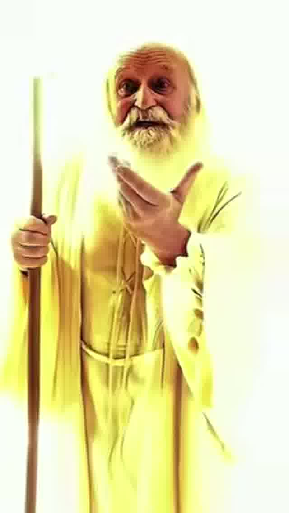

- **Video:** https://youtube.com/shorts/g57xCzBKOuU
- **Seçilen kare:** 4.333 sn · The white-bearded sage in blown-out heavenly light raises his open hand toward the chosen man while solemnly delivering 'Sen seçildin Recep'.
- **Kaynak:** Recep İvedik film series (Şahan Gökbakar comedy), 'dede' vision scene; clip uploaded by STAGE ARCHIVE.
- **Görünen:** Film scene in a blown-out white heavenly light. A burly unshaven man in a striped shirt and jacket stands facing an old man with a long white beard, white robe and a tall wooden staff. The old man gestures toward him and announces solemnly, slowly, like a prophecy: "Sen seçildin Recep." The big man, puzzled and a bit whiny, asks "Neden beni seçtin, neden ben?" The old man answers flatly "Sen tam bir hayvansın." The man is offended ("Oldu mu şimdi bu?") and describes himself as emotional, aggressive, complex, but 'like a cat' inside. The short then cuts to montage clips of the character at home.
- **İnternetteki anlamı:** Used ironically when someone is picked for a job/task nobody wants, or singled out by fate/luck ('seçilmiş kişi' parody); the punchline 'Sen tam bir hayvansın' is the reason he was chosen.
- **Güven:** high · The line is said by the old sage, not by the lead; the lead plays the chosen one. Exact film installment of the scene not verified (search results point to Recep İvedik 3).
- **Director eylemi:** A burst of bright white light fills the street and an old man with a long white beard, a white robe and a wooden staff appears before the mustached cockroach, points at him and says slowly and solemnly in Turkish: "Sen seçildin Recep." The mustached cockroach freezes, points at his own chest and asks, baffled and whiny: "Neden ben?"
- **Araştırma kaynakları:** https://youtube.com/shorts/g57xCzBKOuU, https://www.tiktok.com/discover/sen-se%C3%A7ildin-recep, https://www.youtube.com/watch?v=cFt9eizWkG4, https://en.wikipedia.org/wiki/Recep_%C4%B0vedik

## v02 · Çimenlere girme

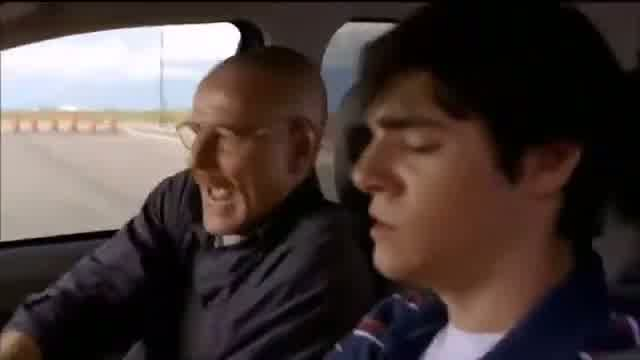

- **Video:** https://youtu.be/CywMzaGoVKU
- **Seçilen kare:** 15.333 sn · The bald father in the passenger seat leans in and shouts in panic at his son driving, the 'çimenlere girme, motoru bağırtma' outburst.
- **Kaynak:** Viral Turkish redub audio over a Breaking Bad driving-lesson scene (channel 'Dejatores'); widely reused on TikTok/Instagram as 'çimenlere girme motoru bağırtma'. Original author of the dub unknown.
- **Görünen:** Turkish comedic re-dub of a TV drama driving-lesson scene: a bald father with glasses sits in the passenger seat while his teenage son drives a beige SUV slowly across an empty parking lot. The father coaches nervously: "Yavaş yavaş yavaş..." then as the car drifts toward the grassy edge he panics: "Çimenlere girme, çimenlere girme, çimenlere girme! Ne yapıyorsun?" and "Motoru bağırtma!" as the engine is revved; close-ups of feet on the pedals, the car lurches and spins with tire smoke, the son wails "Baba olmuyor!".
- **İnternetteki anlamı:** Shouted jokingly at clumsy drivers or anyone about to go off track; used for first driving lessons, parents panicking in the passenger seat, and any 'stay on the road / calm down' situation.
- **Güven:** high · Whisper heard 'motoru bağır da'; the meme and video title use 'motoru bağırtma'. Vehicle is a car in this clip (not a motorbike).
- **Director eylemi:** A nervous teenage boy drives a small car down the street with the mustached cockroach in the passenger seat; the car veers toward the patch of grass and the engine roars. The mustached cockroach grips the dashboard and shouts in Turkish, panicking: "Çimenlere girme, çimenlere girme! Motoru bağırtma!"
- **Araştırma kaynakları:** https://youtu.be/CywMzaGoVKU, https://www.youtube.com/watch?v=YKDJDC8flQQ, https://www.instagram.com/reel/DWwGtzkjLdR/, https://www.tiktok.com/discover/%C3%A7imenlere-girme-motoru-ba%C4%9F%C4%B1rtma-orjinal

## v03 · Yoğurt doldurmak bir sanat işidir

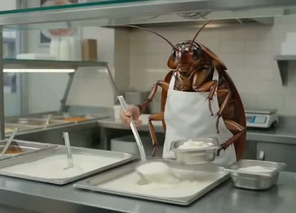

- **Video:** https://youtu.be/0UldTwcROl0
- **Seçilen kare:** 1.667 sn · The aproned cockroach at the steel counter faces camera while scooping a big spatula of white yogurt, the 'yoğurt doldurmak bir sanat işi' craftsman shot.
- **Kaynak:** 'Türkiye hamam böceği videoları' AI video trend (cockroaches doing Turkish tradesman jobs, parodying artisan interview reportages).
- **Görünen:** AI-generated clip: a human-sized cockroach wearing a white apron stands behind a steel cafeteria/buffet counter with trays of white yogurt and small containers, cutting and scooping yogurt into cups with a spatula. It speaks in a calm, proud, documentary-interview voice: "Bazen yoğurt doldurmak çok kolay gözüküyor ama tamamen bir sanat işi. Onu nasıl keseceğiniz, nasıl dolduracağınız... Tabii ki biz bu eğitimleri büyüklerimizden aldığımız için aynı başarıyla devam ettiriyoruz."
- **İnternetteki anlamı:** Mocks the self-important 'this is an art, we learned it from our elders' tone of craftsman/esnaf reportages; used when someone over-dramatizes a trivial task.
- **Güven:** high · Dilanur's phrasing 'bir sanat işidir' differs slightly from the spoken line 'tamamen bir sanat işi'; action uses the spoken line. Cockroach sidekick is optional, only a nod to the source.
- **Director eylemi:** The mustached cockroach ties on a white apron at the wooden table, where a big tray of white yogurt sits, and carefully cuts and spoons yogurt into small cups like a master craftsman while a small cartoon cockroach in an apron watches. He turns to the camera and says proudly in Turkish, in a calm interview tone: "Bazen yoğurt doldurmak çok kolay gözüküyor ama tamamen bir sanat işi."
- **Araştırma kaynakları:** https://youtu.be/0UldTwcROl0, https://www.tiktok.com/discover/hamam-b%C3%B6ce%C4%9Fi-prompt, https://www.youtube.com/shorts/UtS8ILl36uA

## v04 · Anneeğ

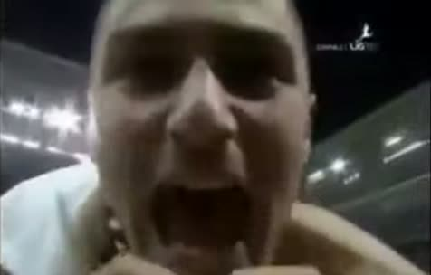

- **Video:** https://youtu.be/524U_wWCw1M
- **Seçilen kare:** 3.0 sn · The shirtless scorer shoves his face into the pitchside lens with his mouth wide open yelling 'Anneeeğ' while holding the hand heart.
- **Kaynak:** Goal celebration of a Turkish striker (widely shared as 'Anne gol sevinci', Trabzonspor fan-site watermark).
- **Görünen:** A footballer who just scored runs shirtless across the pitch in a floodlit stadium, swinging his shirt, straight toward a pitchside camera; he makes a heart shape with his hands, then shoves his face right up to the lens and yells, stretched and hoarse with joy: "Anneeeğ! Anneeeğ!", a greeting to his mother.
- **İnternetteki anlamı:** Used for over-the-top joy or showing off success ('anne bak'), shouting a greeting to mom after an achievement; also imitated for its funny elongated pronunciation.
- **Güven:** high · Exact match/date not verified. Shirtless celebration replaced with cap-waving to keep the fixed costume.
- **Director eylemi:** The mustached cockroach kicks a football into a little goal by the corner shop, whirls his flat cap over his head and sprints straight at the camera. He makes a heart shape with both hands, then pushes his face right up to the lens and yells in Turkish, ecstatic and stretched out: "Anneeeğ!"
- **Araştırma kaynakları:** https://youtu.be/524U_wWCw1M, https://www.youtube.com/shorts/zotfP5RG7fI, https://www.tiktok.com/discover/anne-anne%C4%9F%C4%9F%C4%9F%C4%9F%C4%9F%C4%9F%C4%9F%C4%9F-diyen-futbolcu, https://www.facebook.com/beINSPORTSTR/videos/burak-y%C4%B1lmaz%C4%B1n-unutulmaz-anne-gol-sevinci-/1626674408492358/

## v05 · Sayın Bezmenler

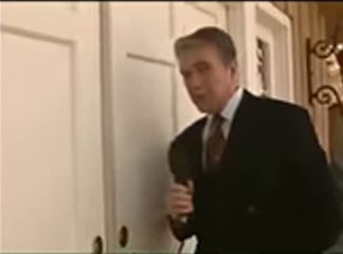

- **Video:** https://youtube.com/shorts/OzvQDrJR_54
- **Seçilen kare:** 4.0 sn · The suited reporter leans against the closed white mansion door with his microphone, speaking 'Sayın Bezmenler, lütfen açar mısınız' to nobody.
- **Kaynak:** Investigative TV journalism (1990s): reporter tracking fugitive banker Halil Bezmen to his mansion in the USA; famous door-knock moment, later a meme and soundboard sound.
- **Görünen:** Archival TV report: a journalist in a dark suit holding a microphone stands at a closed white door of a mansion, knocks, leans close and asks politely but insistently, in a formal, measured tone: "Sayın Bezmenler, lütfen açar mısınız efendim kapıyı? Efendim, Türkiye'den getirdiğiniz paralarla belki bir bardak su ikram edersiniz. Bize lütfen açar mısınız?" Nobody opens. This short then adds a surprise cut to a politician shouting at a lectern ("Seninle beraber olmak istemiyorum") as a gag ending.
- **İnternetteki anlamı:** Used when someone ignores you, does not answer the door, messages or calls ('kapıyı açın artık'), and sarcastically at people who fled with money.
- **Güven:** high · The politician cut at the end of this short is an added gag, not part of the meme; excluded.
- **Director eylemi:** The mustached cockroach, now holding a TV reporter's microphone, knocks firmly on the blue wooden door, leans his ear against it, then says into the mic in a formal, polite but insistent tone in Turkish: "Sayın Bezmenler, lütfen açar mısınız efendim kapıyı?" The door stays shut and he knocks again, waiting.
- **Araştırma kaynakları:** https://youtube.com/shorts/OzvQDrJR_54, https://x.com/kafatv_/status/1580242356636647424, https://x.com/halktvcomtr/status/2035385954718921092, https://www.dailymotion.com/video/x8n0ee5, https://tuna.voicemod.net/sound/0fb280b8-e76f-473a-aa52-2ca2a18ab417

## v06 · La gelir misin lütfen

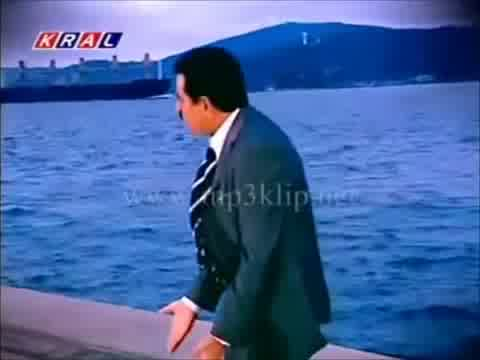

- **Video:** https://youtu.be/yaarX2key1E
- **Seçilen kare:** 6.333 sn · Left alone at the Bosphorus railing after she storms off, the man in the grey suit spreads his hand and calls 'La gelir misin lütfen'.
- **Kaynak:** Intro of the 'Kal Benim İçin' music video (Turkish arabesk singer with a female pop singer as co-star).
- **Görünen:** 1990s music video intro at a Bosphorus seaside railing: a man in a grey suit argues with a blonde woman in a long black coat. He says with hand gestures "Herkese yalan söylerim, sana yalan söylemem." She snaps "İnanmıyorum!", turns and walks away along the railing ("Gidiyorum!"). Left behind, he spreads his hands and calls after her in a rough, exasperated, slightly helpless tone: "La gelir misin lütfen?"
- **İnternetteki anlamı:** Used when someone storms off or sulks ('trip atmak') and you call them back half-annoyed, half-pleading; also a general 'come here please' with the dialect 'La'.
- **Güven:** high · Ekşi Sözlük pages returned 403; content from search snippets. Setup line 'Herkese yalan söylerim, sana yalan söylemem' omitted to fit 6-10 s.
- **Director eylemi:** A woman in a long black coat shouts "İnanmıyorum!" at the mustached cockroach, turns and storms off down the street. He spreads both hands wide and calls after her in Turkish, exasperated and pleading with a rough voice: "La gelir misin lütfen?"
- **Araştırma kaynakları:** https://youtu.be/yaarX2key1E, https://www.youtube.com/watch?v=EmRjDzwrCmg, https://eksisozluk.com/la-gelir-misin-lutfen--2220420, https://eksisozluk.com/herkese-yalan-soylerim-sana-yalan-soylemem--3471875

## v07 · Yalan söyleme yalancı

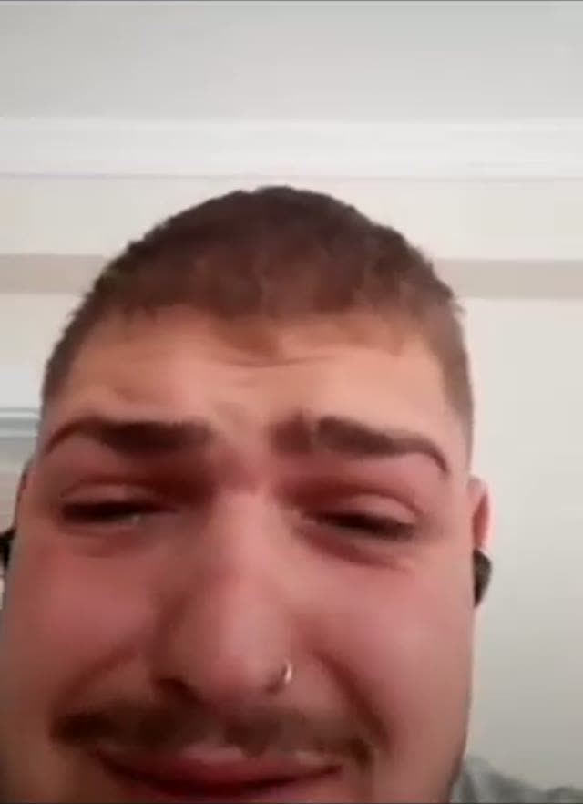

- **Video:** https://youtube.com/shorts/qbJ9dNDU0EY
- **Seçilen kare:** 2.0 sn · Close selfie of the man crying with squinting wet eyes and trembling mustached lips, the 'yalan söyleme, inanmıyom' sob.
- **Kaynak:** Viral selfie crying video (social media user); exact original uploader unknown.
- **Görünen:** Selfie phone video: a young man with short hair and a moustache films himself up close in a plain room, crying with squinting wet eyes, trembling lips and a scrunched brow, and whines in a sobbing voice: "La sus yalancı, yalan söyleme la, inanmıyom inanmıyom."
- **İnternetteki anlamı:** Reaction to news that is too good or too bad to believe, or to someone's obvious lie; used in dramatic 'I can't believe it' moments, often in sports and relationship contexts.
- **Güven:** medium · Whisper transcript was garbled; line taken from widely used video titles of the same clip and matches audible 'yalancı'. Some titles attribute it to a named person; unverified and deliberately not used.
- **Director eylemi:** The mustached cockroach holds a phone up close to his face like a selfie, his eyes squeezed and watery, lower lip trembling, and he shakes his head while sobbing in Turkish, whiny and broken: "La sus yalancı, yalan söyleme la, inanmıyom inanmıyom!"
- **Araştırma kaynakları:** https://youtube.com/shorts/qbJ9dNDU0EY, https://www.youtube.com/shorts/ujqVkPa7dbY, https://www.youtube.com/watch?v=83rWC2hWhTY, https://www.tiktok.com/discover/yalan-s%C3%B6yleme-inanm%C4%B1yom-inanm%C4%B1yom

## v08 · Yeter artık, buramıza geldi ya

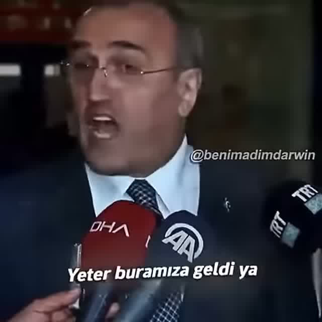

- **Video:** https://youtube.com/shorts/6SgmNVKgLuk
- **Seçilen kare:** 3.333 sn · He shouts 'Yeter buramıza geldi ya' mouth wide open into the pile of news microphones, the peak of the outburst; subtitles and mic logos are burnt in on every frame.
- **Kaynak:** Post-match press statement by a football club executive after a 2021 league defeat, protesting refereeing decisions (a red card). The TV clip became a viral reaction video.
- **Görünen:** A middle-aged man in a dark suit, tie and glasses stands at night in front of a stadium, surrounded by a bunch of TV and news-agency microphones pushed at his face by reporters. He is furious and exasperated, voice rising and cracking: "Yeter artık! Yeter, buramıza geldi ya! Nedir bu be?" Short, choppy outburst, like someone who has run out of patience.
- **İnternetteki anlamı:** 'Enough, I'm fed up to here' (buramıza geldi = it has come up to here, usually with a hand at the throat/chin). Used as a reaction when someone has reached their limit with a recurring annoyance: bad refereeing, work, traffic, exams, etc.
- **Güven:** high · The throat-level hand gesture is the conventional gesture for 'buramıza geldi'; in the clip his hands are mostly low, so it is added for readability. Microphones must stay logo-free.
- **Director eylemi:** A reporter pushes a bunch of plain microphones at the mustached cockroach's face. Red-faced and trembling with anger, he taps the edge of his flat hand against his throat and shouts in Turkish, voice cracking with exasperation: "Yeter artık! Yeter, buramıza geldi ya! Nedir bu be?"
- **Araştırma kaynakları:** https://www.youtube.com/shorts/6SgmNVKgLuk, https://www.takvim.com.tr/spor/2021/03/03/galatasaray-2nci-baskani-abdurrahim-albayrak-ankaragucu-maci-sonrasi-isyan-etti-adalet-istiyoruz-baska-bir-sey-istemiyoruz, https://www.hurriyet.com.tr/sporarena/galatasarayda-abdurrahim-albayraktan-canli-yayinda-sert-tepki-adalet-istiyoruz-41754324, https://eksisozluk.com/nah-burama-geldi-artik--52721

## v09 · Ya ne anlatıyon be abla

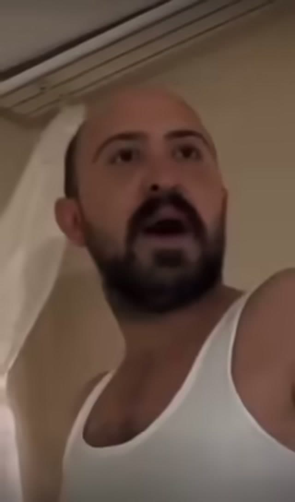

- **Video:** https://youtube.com/shorts/M_V7cAi1o0A
- **Seçilen kare:** 2.0 sn · Looking up off camera with raised brows and mouth open, the baffled 'ne anlatıyon be abla' reaction, face sharp.
- **Kaynak:** Short comedy sketch by a Turkish social media content creator (Instagram/TikTok, around 2023).
- **Görünen:** Selfie-style sketch: a bald, bearded man in a white sleeveless undershirt stands in a bedroom by a curtain, looking up and sideways at someone off camera (a woman who has been talking to him). Baffled and fed up, pleading tone, slightly whiny: "Ya ne anlatıyon be abla, gözünü seveyim be abi!" then, disappointed: "Böyle mi olduk abi şimdi ya?" The joke includes mixing 'abla' (sister) and 'abi' (brother) in the same breath.
- **İnternetteki anlamı:** 'What on earth are you going on about?' Said to someone who talks at length without making sense, jumps between topics, or makes an absurd/narrow point. Used a lot in comment sections and at work as playful exasperation.
- **Güven:** high · Original is a single-person sketch; the talking woman is shown in our version so the reaction has a target. Some sources write 'Sen ne anlatıyon'; the video itself starts with 'Ya'.
- **Director eylemi:** A woman chatters nonstop at the mustached cockroach, waving her hands and pointing in every direction. Completely lost, he stares at her, spreads his palms and says in Turkish, baffled and pleading: "Ya ne anlatıyon be abla, gözünü seveyim be abi!" Then he droops his shoulders and sighs: "Böyle mi olduk abi şimdi ya?"
- **Araştırma kaynakları:** https://www.youtube.com/shorts/M_V7cAi1o0A, https://eksisozluk.com/ne-anlatiyon-be-abla-gozunu-seveyim-be-abi--7632387, https://www.uludagsozluk.com/k/sen-ne-anlat%C4%B1yon-be-abla-g%C3%B6z%C3%BCn%C3%BC-seveyim-be-abi/, https://normalsozluk.com/b/sen-ne-anlatiyon-be-abla-gozunu-seveyim-be-abi--306105, https://tenor.com/view/sen-ne-anlat%C4%B1yon-be-abla-g%C3%B6z%C3%BCn%C3%BC-seveyim-be-abi-gif-6801944612718141626

## v10 · Gene başladı

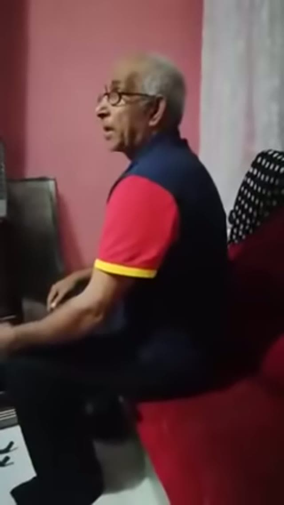

- **Video:** https://youtube.com/shorts/2Wmoa5VENnE
- **Seçilen kare:** 2.0 sn · Sharpest frame of the old man on his low stool by the stove, turned mid-grumble with mouth open as he repeats 'gene başladı'.
- **Kaynak:** Viral family video of an elderly man known online as 'Mokali/Mokoli Amca', filmed by a relative and shared on TikTok (hashtags suggest a recurring nuisance/ailment).
- **Görünen:** Home video: an elderly man with white hair and glasses, in a red-sleeved polo and dark vest, sits on a low red stool right next to a small wood-burning stove in a pink room; a woman in a polka-dot dress sits silently behind him. He turns his head, then flicks his hand toward the stove and repeats in a weary, grumbling monotone, over and over: "Gene başladı, bir haftadan beri ... atıyor. Gene başladı, gene başladı, gene başladı."
- **İnternetteki anlamı:** 'Here we go again.' Said when something annoying or bad happens yet again: a recurring problem, a person starting the same complaint, bad news repeating.
- **Güven:** medium · What exactly 'started again' is unclear: audio after the first 'gene başladı' is unclear ('bir haftadan beri ... atıyor', maybe the stove acting up or an ailment). He gestures toward the stove and holds a small white object (possibly a cigarette, omitted). The smoking stove is our visual stand-in for the recurring nuisance.
- **Director eylemi:** The mustached cockroach sits hunched on a low stool beside a small iron wood stove. The stove clanks and coughs out another puff of smoke; he rolls his eyes, flicks his hand at it again and again and grumbles in Turkish in a flat, weary monotone: "Gene başladı, gene başladı, gene başladı!"
- **Araştırma kaynakları:** https://www.youtube.com/shorts/2Wmoa5VENnE, https://x.com/ArthrMrgnVideo/status/1764010384107741614, https://www.tiktok.com/@mokali_amcafan88/video/7472453106597416199, https://www.seslisozluk.net/gene-ba%C5%9Flad%C4%B1-nedir-ne-demek/

## v11 · Bu benim kaderim

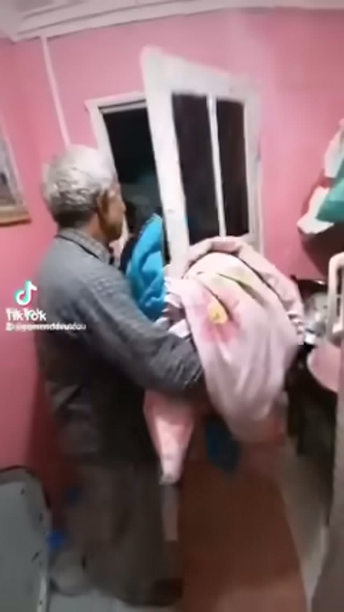

- **Video:** https://youtube.com/shorts/VTQi98hm6MU
- **Seçilen kare:** 0.667 sn · The key action: he hauls a huge armful of pink and blue quilts toward the storeroom door while muttering 'bu benim kaderim'.
- **Kaynak:** TikTok video of 'Mokali Amca' posted by a creator who films his elderly relative (@egemendavulcu); later remixed into a TikTok sound.
- **Görünen:** Phone video filmed by a younger relative: an elderly white-haired man in grey clothes carries a big armful of pink and blue quilts, pillows and bags out of a pink hallway into a cramped dark storeroom already piled with bedding, then bends down to pick up more bags. The whole time he mutters in a resigned, sing-song monotone: "Bu benim kaderim, bu benim kaderim bu, bu benim kaderim, kaderim benim bu."
- **İnternetteki anlamı:** 'This is my fate.' Resigned self-pity used when you are stuck with the same burden again: chores, work, supporting a losing team, always being the one who has to carry/fix things.
- **Güven:** high · Why he is carrying the bedding is not stated in the clip; the chore itself is the joke.
- **Director eylemi:** The mustached cockroach staggers under a huge armful of pink quilts and pillows, shoves them through the blue wooden door into a cramped storeroom stacked with bedding, then bends to pick up yet another bundle. Resigned, sighing, he mutters in Turkish in a sing-song monotone: "Bu benim kaderim, bu benim kaderim."
- **Araştırma kaynakları:** https://www.youtube.com/shorts/VTQi98hm6MU, https://www.tiktok.com/discover/mokali-amca-bu-benim-kaderim, https://www.tiktok.com/@egemendavulcu/video/6895094832755215617, https://www.tiktok.com/discover/bu-benim-kaderim-diyen-amca-full

## v12 · Abi geldiler abi

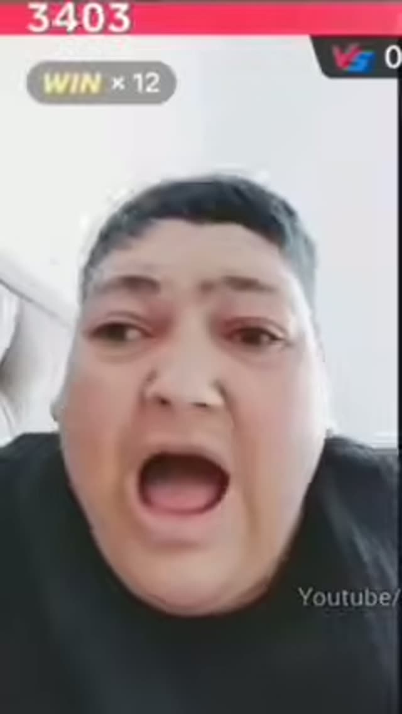

- **Video:** https://youtube.com/shorts/i8LMIH3ky_U
- **Seçilen kare:** 0.333 sn · Mouth wide open, eyes squinting, wailing 'Abi geldiler abi' right as the battle score jumps; score bar overlay is part of the meme.
- **Kaynak:** TikTok live broadcast of a Turkish streamer; the clip spread as a meme and was remixed into songs in 2024.
- **Görünen:** TikTok live-stream battle (PK) screen: a heavyset streamer with short dark hair and a black sweater films himself close-up on a phone. As his score bar jumps (roughly 3400 to 3900), he cries out in a high, strained, emotional, almost wailing voice with mouth wide open and eyes squinting: "Abi geldiler abi!" (repeated). He sounds overwhelmed, half crying, half ecstatic.
- **İnternetteki anlamı:** 'Bro, they've come, bro!' Shouted when reinforcements/support suddenly arrive (gifts in a live battle, friends showing up, fans arriving). Also used ironically for any group turning up, e.g. football fans, police, the family at the door.
- **Güven:** medium · Whisper could not transcribe the audio; the line comes from the video title and TikTok pages. 'Geldiler' interpreted as supporters/gifts arriving, based on the visible score jump; the original backstory is not documented in sources found.
- **Director eylemi:** The mustached cockroach holds a smartphone right up to his face as if live streaming. Suddenly a flood of cartoon hearts and gift boxes bursts out of the screen around him; overwhelmed, eyes squeezed half shut, mouth wide open, he wails in Turkish in a high, emotional, almost crying voice: "Abi geldiler abi!"
- **Araştırma kaynakları:** https://www.youtube.com/shorts/i8LMIH3ky_U, https://www.tiktok.com/discover/abi-geldiler-abi-hakan-ya%C4%9Far-orjinal, https://www.tiktok.com/@hakanyagar98/video/7431531268526886152, https://open.spotify.com/intl-tr/track/2uoPaQT6LnrAZFrpc0eBmM

## v13 · Ee sen şimdi naneyi yemedin mi

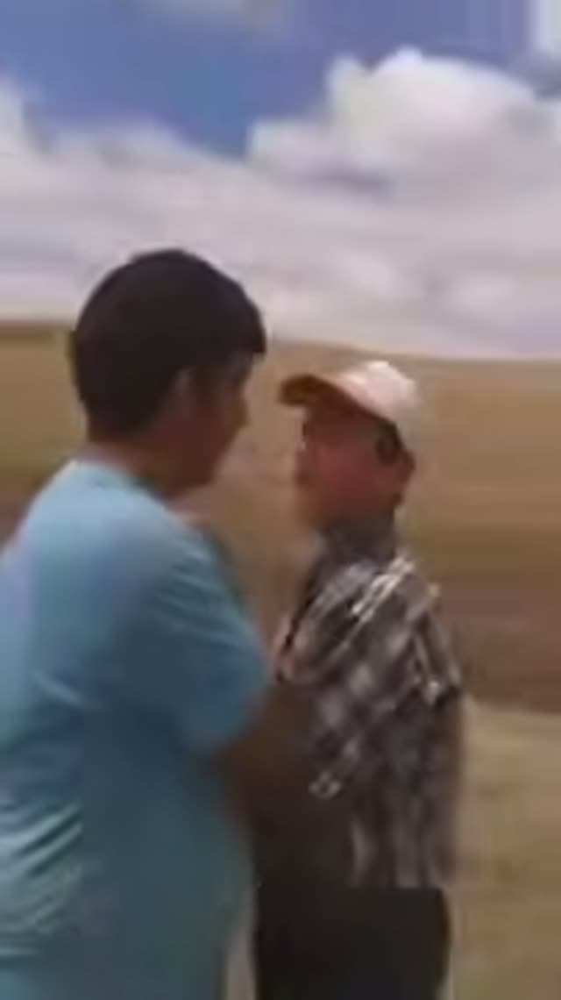

- **Video:** https://youtube.com/shorts/Z8nYuPBzcvc
- **Seçilen kare:** 2.667 sn · The two youths squared up face to face gripping shirt fronts, both faces visible, the calm 'naneyi yemedin mi' standoff.
- **Kaynak:** Old viral amateur video of two village youths arguing/'fighting' while oddly chatting; widely shared as 'kavga ederken muhabbet eden çocuklar'.
- **Görünen:** Shaky phone footage on a dry, open steppe field under a cloudy sky: a young man in a light-blue T-shirt walks up to a smaller young man in a plaid shirt and a white cap. They square up nose to nose, gripping each other's shirt fronts as if about to fight, but instead of hitting, one asks in a calm, slow, almost conversational tone: "Ee şimdi sen naneyi yemedin mi?"
- **İnternetteki anlamı:** 'Naneyi yemek' = to mess up badly / get yourself into trouble. 'Well, haven't you gone and blown it now?' Used when someone has clearly screwed up and is about to face the consequences, delivered with calm, mock-threatening irony.
- **Güven:** high · Word order varies across reposts ('E sen şimdi' / 'Ee şimdi sen'); the video title and audio suggest 'Ee şimdi sen'. Which of the two youths says the line is hard to see; ours gives it to the lead. Keep it a standoff, no hitting.
- **Director eylemi:** A young man in a blue T-shirt marches up to the mustached cockroach on the patch of grass; they stand nose to nose, holding each other's shirt fronts as if a fight is coming, but nobody swings. The mustached cockroach tilts his head and asks in Turkish, calm, slow and deadpan: "Ee şimdi sen naneyi yemedin mi?"
- **Araştırma kaynakları:** https://www.youtube.com/shorts/Z8nYuPBzcvc, https://www.facebook.com/ohafilmebak/videos/kavga-ederken-muhabbet-eden-%C3%A7ocuklar-e-%C5%9Fimdi-sen-naneyi-yimedin-mi/188131996793869/, https://www.youtube.com/watch?v=cy4pnc9e2w0, https://tenor.com/view/nane-naneyi-yemedin-mi-sen-%C5%9Fimdi-naneyi-yemedin-mi-duello-kavga-gif-15112605042884954713

## v14 · Aç lan gapıyı

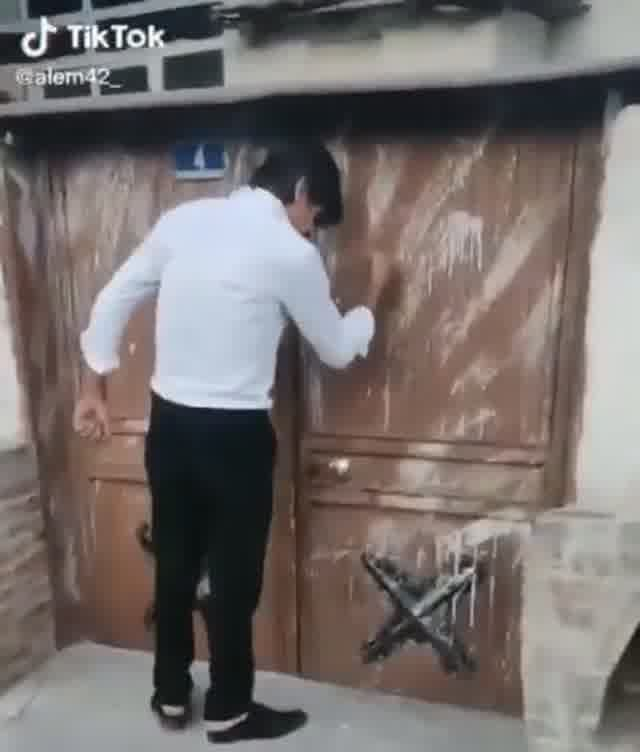

- **Video:** https://youtube.com/shorts/828WG2TJGNk
- **Seçilen kare:** 3.667 sn · He pounds on the scratched brown gate with his fist, the 'Aç lan gapıyı' moment; TikTok watermark stays in the top corner off the subject.
- **Kaynak:** TikTok video of a Konya-based social media personality known as 'Ünal Baba' (account @alem42).
- **Görünen:** TikTok clip on a quiet residential street: a young man with shoulder-length dark hair, white shirt and black trousers strides angrily along the pavement to a large, scratched brown wooden double gate, pounds on it with his hand, grabs and rattles the handle and yells, furious and impatient: "Aç lan gapıyı!" (Anatolian pronunciation of 'kapıyı').
- **İnternetteki anlamı:** 'Open the damn door!' Used when someone is angrily demanding to be let in, locked out, impatient waiting, or as a comic outburst of rage at anything that won't open or respond.
- **Güven:** high · Whisper heard 'kapıyı'; Dilanur's dialect spelling 'gapıyı' is kept in label and line. No one opens the door in the clip.
- **Director eylemi:** The mustached cockroach storms down the street to the blue wooden door, pounds on it with his fist, grabs the handle and rattles it hard, then leans in and yells in Turkish, furious and impatient, in a thick Anatolian accent: "Aç lan gapıyı!"
- **Araştırma kaynakları:** https://www.youtube.com/shorts/828WG2TJGNk, https://x.com/turkvideomeme/status/1806317446778761472, https://www.tiktok.com/discover/a%C3%A7-lan-kap%C4%B1y%C4%B1-%C3%BCnal-baba, https://www.youtube.com/watch?v=bVUeoUWDGvs

## v15 · Terliyorum

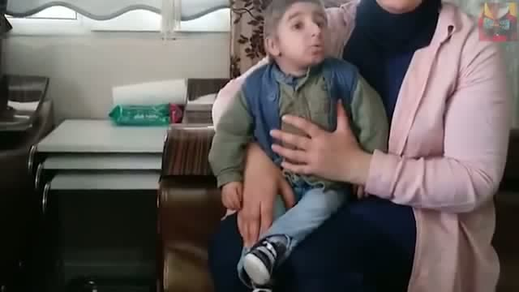

- **Video:** https://youtu.be/u893TuSkGpQ
- **Seçilen kare:** 3.0 sn · The boy looks up at the camera with pursed, rounded lips at the moment he interrupts his mother with the flat 'Terliyorum'.
- **Kaynak:** Viral clip of a child known online as 'Burak Reis' (a boy with a growth condition who later became a social media content creator with his family); the clip comes from an interview where his mother appeals for help. Spread as GIFs/shorts around 2020-2022.
- **Görünen:** 12-second phone clip from a local news-style interview in a living room. A mother in a pink cardigan sits on a sofa holding her small son on her lap; she calmly explains to the reporter that there is no improvement in his growth and that they ask the Ministry of Health for help. The boy is restless, rolling his head around, looking up at the ceiling and sideways, clearly bored. In the middle of her serious explanation he interrupts in a small, flat, whiny voice: "Terliyorum." (I'm sweating.) The mother keeps talking.
- **İnternetteki anlamı:** Used as a deadpan reaction when a situation gets tense, awkward or stressful ('terledim', I'm under pressure), when it is hot, or to comically interrupt a serious conversation with an irrelevant personal complaint.
- **Güven:** medium · Whisper did not reliably catch the word; a biased re-transcription of seconds 1.5-4.5 gave 'Terliyorum' and the title confirms it. The original involves a real child with a medical condition, so the action keeps only the deadpan interruption and no likeness or mockery of the child.
- **Director eylemi:** A serious woman stands beside the mustached cockroach and talks earnestly to a reporter holding a microphone. The mustached cockroach sits at the wooden table, bored, rolling his head and staring at the sky, then interrupts her, fanning his face with his cap, and says in Turkish in a small, flat, whiny voice: "Terliyorum."
- **Araştırma kaynakları:** https://youtu.be/u893TuSkGpQ, https://tenor.com/view/burak-reis-c%C3%BCce-reis-terliyorum-gif-24348735, https://tenor.com/view/terliyorum-gif-19473957, https://eksisozluk.com/burak-reis--696344, https://devletkredileri.com/burak-reis-kimdir-burak-ozbek-hakkinda-merak-edilenler/

## v16 · Çok şükür Yarabbi

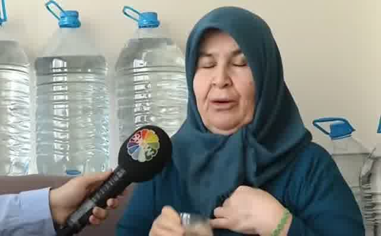

- **Video:** https://youtu.be/khdz4-m2uOo
- **Seçilen kare:** 4.67 sn · Right after the long gulp she lowers the glass, closes her eyes and exhales 'Oh, çok şükür Yarabbim' with deep relief in front of the water bottles.
- **Kaynak:** 2019 TV news / morning show story (Show TV, 'Zahide Yetiş'le' era) about a 66-year-old woman who drinks about 25 liters of water a day due to an illness ('günde 25 litre su içen kadın').
- **Görünen:** 7-second TV news clip. An older woman in a blue headscarf sits on a sofa in front of a row of large 10-liter water bottles; a male reporter holds a microphone to her. She drinks a full glass of water in long, greedy gulps with her other hand pressed on her chest, then lowers the glass, closes her eyes and exhales with deep relief: "Oh, çok şükür Yarabbim" (Oh, thank God), then covers her mouth.
- **İnternetteki anlamı:** Reaction for deep, physical relief and satisfaction: finally drinking water when thirsty, finishing an exam, something finally working out. Often posted with a sigh of relief.
- **Güven:** high · Spoken line is 'Oh çok şükür Yarabbim'; Dilanur's label says 'Yarabbi', kept as label.
- **Director eylemi:** The mustached cockroach sits at the wooden table next to a row of huge water bottles while a reporter holds a microphone to him. He gulps down a full glass of water in long greedy swallows, one hand pressed on his chest, then lowers the glass, closes his eyes and exhales with deep relief in Turkish: "Oh, çok şükür Yarabbim."
- **Araştırma kaynakları:** https://youtu.be/khdz4-m2uOo, https://eksisozluk.com/gunde-25-litre-su-icen-kadin--5975959, https://onedio.com/haber/gunde-25-litre-su-icen-66-yasindaki-necla-teyze-ve-o-teyzeye-sosyal-medyadan-gelen-tepkiler-865867, https://www.haberler.com/magazin/gunde-25-litre-su-icen-kadin-hayat-hikayesiyle-11859243-haberi/, https://tenor.com/view/oh%C3%A7ok%C5%9F%C3%BCk%C3%BCr-yarabbim-su-i%C3%A7en-teyze-oh-%C3%A7ok%C5%9F%C3%BCk%C3%BCr-%C3%A7ok%C5%9F%C3%BCk%C3%BCr-yarabbi-gif-26464802

## v17 · Selam sana İmparator

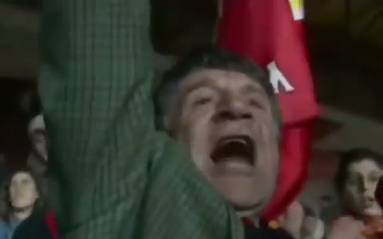

- **Video:** https://youtu.be/EUntf5aLnOA
- **Seçilen kare:** 4.33 sn · The fan, arm raised high in salute with the red-and-yellow flag behind him, shouts 'Selam sana İmparator' with his mouth wide open; cropped to drop the watermark.
- **Kaynak:** Galatasaray fan in the stands saluting the coach nicknamed 'İmparator' (the Emperor); archival stadium footage (watermark fatsports) that re-circulated on X in 2025, then fueled Fatih Terim edits and a 2025 single titled 'Selam Sana İmparator'.
- **Görünen:** 7-second low-angle close shot in a night football stadium under floodlights. An older male fan in a green checked jacket, with red-and-yellow flags waving behind him and other fans around, raises his right arm high with an open palm in a salute toward the pitch and shouts rhythmically, hoarse and passionate, three times: "Selam sana İmparator!" One cutaway shows just the raised open palm against the floodlights.
- **İnternetteki anlamı:** Used to salute someone who made a masterful, dominant or legendary move, sincerely or ironically ('respect to the boss'); also a general edit/meme sound on TikTok for 'emperor' figures.
- **Güven:** high · Exact source match/date of the original stadium footage not confirmed. The street-at-night framing may fight the premise's daytime street; a daytime version (drop 'at night under floodlights') also works.
- **Director eylemi:** The mustached cockroach stands on the street at night under bright floodlights, a red-and-yellow scarf around his neck. He raises his right arm high with an open palm in a solemn salute and shouts three times in Turkish, rhythmically, hoarse and full of passion: "Selam sana İmparator!"
- **Araştırma kaynakları:** https://youtu.be/EUntf5aLnOA, https://x.com/i/status/1903572274030002672, https://open.spotify.com/track/1SIpn1vUiGtRgExuC7cuKt, https://www.tiktok.com/discover/selam-sana-imparator, https://www.tiktok.com/discover/selam-sana-imparator-fatih-terim

## v18 · Hemen engellendin koçum

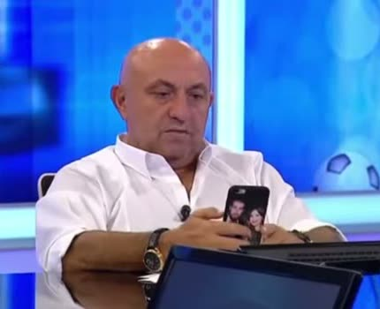

- **Video:** https://youtu.be/xNmLQXKvH4g
- **Seçilen kare:** 2.0 sn · The pundit looks down at his phone and speaks with calm, smug finality as he says 'Hemen engellendin koçum'; cropped to drop channel logos.
- **Kaynak:** Live Turkish TV football debate show (Beyaz TV 'Beyaz Futbol' studio); a former footballer turned pundit blocks a social media user on air.
- **Görünen:** 15-second clip from a live TV football talk show. A bald pundit in a white shirt sits at the studio desk, looking down at his smartphone, reading a message someone sent him. Calmly, smugly and matter-of-factly, while tapping the phone, he says: "Hemen engellendin, hemen engellendin koçum" (you're blocked right away, buddy), adds that there's nothing like that, then: "Hemen gittin buradan, sana güle güle" (you're gone from here, bye-bye).
- **İnternetteki anlamı:** Reply to annoying, rude or nonsensical comments/DMs: 'you're blocked'. Used when cutting someone off online or ending a pointless argument, with smug finality.
- **Güven:** high · Opening words in the transcript ('mali al bayrak') are unclear, maybe a username being read. Exact broadcast date not confirmed (clips circulated from 2023).
- **Director eylemi:** The mustached cockroach sits at the wooden table staring down at his smartphone, reading an annoying message. Unimpressed, he jabs the screen with his finger, looks up at the camera with a smug little smile and says in Turkish, calm and dismissive: "Hemen engellendin, hemen engellendin koçum. Sana güle güle!" and waves goodbye.
- **Araştırma kaynakları:** https://youtu.be/xNmLQXKvH4g, https://www.youtube.com/watch?v=mtzi9i0xhY4, https://twitter.com/deporepository/status/1898383135949095353, https://x.com/patrickarsiv/status/1666428437152636933, https://www.tiktok.com/discover/hemen-engellendin-kocum-orjinal

## v19 · Nasıl

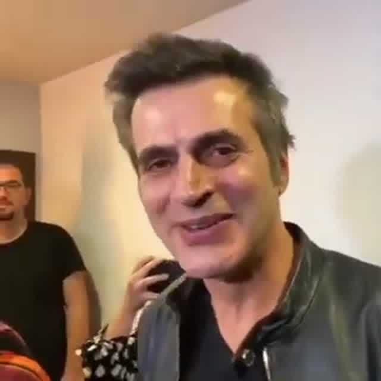

- **Video:** https://youtube.com/shorts/ybrhaO15lA4
- **Seçilen kare:** 4.0 sn · The singer squints and leans in with a puzzled, sheepish half-smile at the 'Nasıl?' moment after hearing 'Necəsiz?'.
- **Kaynak:** Interview before a concert in Baku, widely shared as the singer's 'imtihan' (ordeal) with Azerbaijani Turkish; the confusion between Azeri 'necəsiz' and Turkish 'nasılsınız'.
- **Görünen:** 9-second phone clip backstage. A famous Turkish rock singer in a black leather jacket, surrounded by fans, is greeted by an Azerbaijani host/reporter off-camera: "Xoş gəldiniz" / he replies "Merhaba, hoş bulduk". She then asks in Azerbaijani "Necəsiz?" (how are you?). He doesn't understand, squints, leans in with a puzzled half-smile and asks "Nasıl?" (How? / Sorry, what?); she clarifies "Nasılsınız?" and he grins sheepishly.
- **İnternetteki anlamı:** Confused 'come again?' reaction when someone says something you can't parse (dialect, jargon, nonsense), or feigned incomprehension; the sheepish squint plus 'Nasıl?'.
- **Güven:** high · Whisper heard 'Necelsiz'; Azerbaijani spelling is 'Necəsiz'. The model may pronounce it in Turkish; the key beat is the confused 'Nasıl?'.
- **Director eylemi:** A smiling woman walks up to the mustached cockroach and greets him warmly, asking in Azerbaijani: "Necəsiz?" The mustached cockroach freezes, squints, leans his ear toward her with a puzzled, sheepish half-smile and asks in Turkish, drawn out and confused: "Nasıl?"
- **Araştırma kaynakları:** https://youtube.com/shorts/ybrhaO15lA4, https://www.youtube.com/watch?v=f5r21Wn8ju8, https://www.youtube.com/watch?v=1ZZzjqu3nd8, https://www.tiktok.com/discover/teoman-nas%C4%B1l-azeri

## v20 · Yirmağa gideyrum

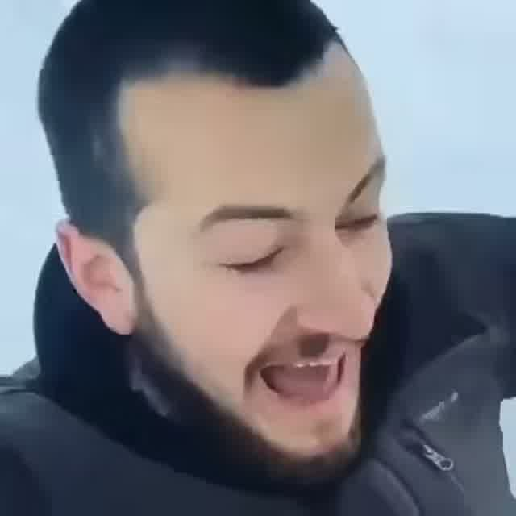

- **Video:** https://youtube.com/shorts/nsSEvV3PDLY
- **Seçilen kare:** 26.67 sn · Mid-slide down the snowy slope, he yells half laughing, half panicking at the 'Yırmağa gideyrum' moment, face filling the selfie frame.
- **Kaynak:** Viral amateur selfie video from the Eastern Black Sea highlands (circa 2017), dialect pronunciation of 'ırmağa gidiyorum'.
- **Görünen:** 59-second selfie video on a snowy mountain slope. A young bearded man in a dark fleece, filming himself, complains he can't ski, tries to join a friend, then slips and slides down the steep snow on his back/bottom, unable to stop, the camera spinning between his face, sky and snow. Heading toward a stream at the bottom, he yells in Black Sea dialect, half laughing, half panicking: "Ula yırmağa gideyrum! Yırmağa gideyrum!" (I'm going into the river!). He lands in the wet grassy area shouting "Lan yırmağa düştüm" and scolds friends "Nasıl insansınız he"; later a blank pistol's tip breaks off ("Tabancanın ucu kopti").
- **İnternetteki anlamı:** Used when something is sliding out of control toward disaster and you can only watch and narrate it: failing plans, grades, the economy ('gidişat'); also a funny Black Sea dialect catchphrase.
- **Güven:** high · Premise street is not snowy; the action introduces snow and a stream, which the model may handle loosely. Some sites wrongly attribute the phrase to a TV series; the video itself is the source.
- **Director eylemi:** The mustached cockroach slips on a sheet of snow at the top of the steep street and slides down on his back, unable to stop, holding his phone up to film himself, arms flailing, speeding toward a little stream at the bottom. He yells in Turkish with a Black Sea accent, half laughing, half panicking: "Ula yirmağa gideyrum! Yirmağa gideyrum!"
- **Araştırma kaynakları:** https://youtube.com/shorts/nsSEvV3PDLY, https://www.uludagsozluk.com/k/yirma%C4%9Fa-gideyrum/, https://www.nedemek.page/kavramlar/y%C4%B1rma%C4%9Fa%20gideyrum, https://1000kitap.com/ulaaaaa-yirmaga-gideyrum--131586/alintilar, https://www.youtube.com/watch?v=KgnlZHG4LeQ

## v21 · Noluyor lan kim bu

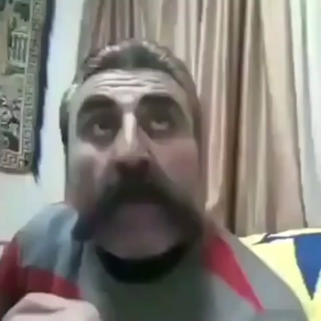

- **Video:** https://youtube.com/shorts/TiLNcKk_tnI
- **Seçilen kare:** 1.33 sn · Right after the dark opening, the mustached man is jolted, eyes wide and staring up in alarm, as he shouts 'Noluyo lan? Kim lan bu?'.
- **Kaynak:** Amateur viral home video of a mustached 'dayı' (uncle), shared on TikTok/Tenor, sometimes tagged 'uyanan dayı' (the uncle who wakes up); exact first upload unknown.
- **Görünen:** 12-second home video. A middle-aged man with a huge handlebar mustache, in a red-and-grey striped sweater, sits on a sofa in a living room with curtains. The screen is dark for a moment, then he is suddenly jolted, eyes wide, staring up and whipping his head left and right in alarm, and shouts in a gruff, panicked voice: "Noluyo lan? Kim lan bu?" (What the hell is going on? Who the hell is this?). He then leaps off the sofa and dives over/behind it to look, his back to the camera.
- **İnternetteki anlamı:** Reaction to something or someone unexpected suddenly appearing: a stranger joining a group chat, a surprise plot twist, an unknown person in a photo; alarmed confusion.
- **Güven:** medium · Whisper only caught 'Ne oluyor lan? Kim lan bu?'; spoken form is colloquial 'Noluyo lan? Kim lan bu?'. What startles him (waking up vs. a sudden sound) is not fully certain; the dark opening suggests lights off/sleeping. One search summary claimed a 'hiding from the butcher' sketch, unverified.
- **Director eylemi:** The mustached cockroach dozes on a chair by the wooden table, then jolts awake, eyes bulging, whipping his head left and right in alarm, and shouts in Turkish, gruff and panicked: "Noluyo lan? Kim lan bu?" Then he leaps up and dives behind the table to peek out suspiciously.
- **Araştırma kaynakları:** https://youtube.com/shorts/TiLNcKk_tnI, https://tenor.com/view/noluyo-lan-kim-lan-bu-gif-19936584, https://tenor.com/view/noluyo-lan-noluyo-day%C4%B1-noluyo-lan-he-uyanan-day%C4%B1-gif-18242774, https://www.tiktok.com/discover/noluyo-lan-kimlan-bu-diyen-day%C4%B1

## v22 · La bizi kim alabilir

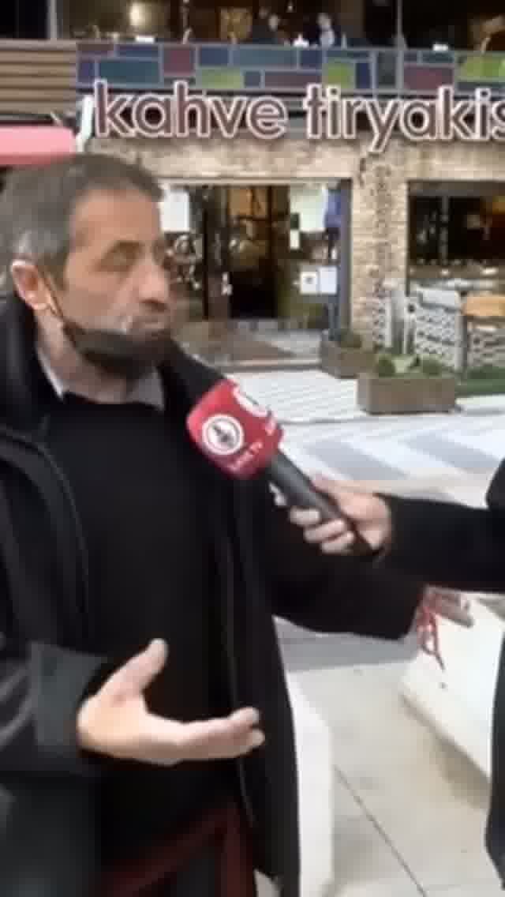

- **Video:** https://youtube.com/shorts/7ai2BrEDlyk
- **Seçilen kare:** 5.0 sn · Mid-line ('La bizi kim alabilir... şansı yok') with his face toward camera, the red mic in front and the signature open-palm shrug gesture.
- **Kaynak:** Viral street interview (sokak röportajı) by a Trabzon local news channel (61 Saat / 61 Medya style red microphone), circa 2021-2022; the exact question asked is not confirmed.
- **Görünen:** Street interview in a Trabzon city square in front of a café (COVID era, man has a face mask pulled down under his chin). A middle-aged local man in a long black coat and black sweater talks into a red TV microphone held by an off-screen reporter. He spreads both open palms outward, shrugs and gestures toward the square, and says with swaggering, matter-of-fact Black Sea confidence: "La bizi kim alabilir? Biz buradayız... şansı yok." Reporter asks "Neresin abi?" and he answers "Ben Trabzon Akçaabat'lıyım." Delivery: relaxed, cocky, unbothered, local dialect ('la' = ulan).
- **İnternetteki anlamı:** 'Kim bizi yenebilir / bize kim dokunabilir?' Boastful, unbeatable-confidence reaction, strongly tied to Trabzon/Karadeniz pride and Trabzonspor; used when a team, group or person feels nobody can beat them, and even quoted by athletes (e.g. a Trabzon boxer after winning a title in 2026).
- **Güven:** high · Line checked with Whisper small and medium: 'La/Ulan bizi kim alabilir? Biz buradayız' is clear; the middle words before 'şansı yok' are unclear (possibly 'senin şansın yok'), so the action uses the clear parts. The interview question (likely Trabzonspor title race) is not confirmed.
- **Director eylemi:** A cartoon street reporter holds a red microphone up to him. He pulls his chin up, spreads both open palms wide, shrugs and says in Turkish with cocky Black Sea swagger, totally unbothered: "La bizi kim alabilir? Biz buradayız, şansı yok!" He then taps his chest proudly and grins.
- **Araştırma kaynakları:** https://youtube.com/shorts/7ai2BrEDlyk, https://www.facebook.com/61saat/posts/la-bizi-kim-alabilir-bize-endonezyada-trabzon-%EF%B8%8F-video-k%C3%BCbra-akta%C5%9F/1628247602642198/, https://www.haber61.net/trabzon/avrupa-sampiyonu-havvanur-kethuda-dan-ilk-sozler-bizi-kim-alabilir-ben-trabzonluyum/644477, https://www.kuzeyekspres.com.tr/haber/28866953/trabzonsporlu-boksor-havvanur-kethuda-avrupa-sampiyonasinda-finale-yukseldi-la-bizi-kim-alabilir, https://www.tiktok.com/@maviskadir61/video/7039402981447503106

## v23 · Aynen aynen

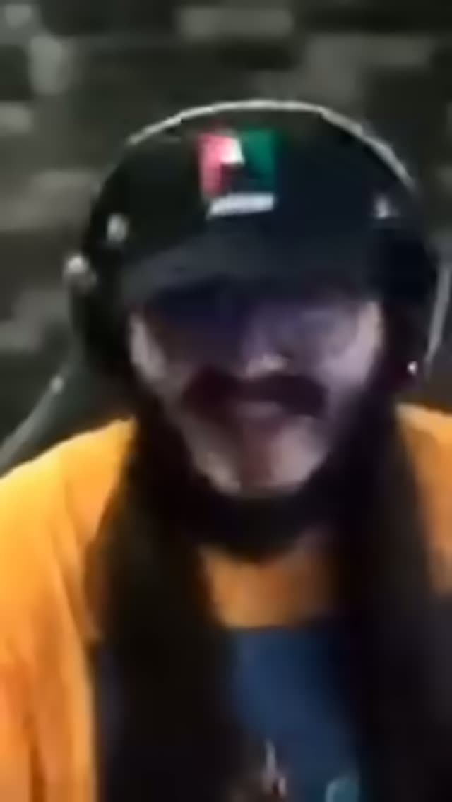

- **Video:** https://youtube.com/shorts/U80sdDhTIZQ
- **Seçilen kare:** 2.33 sn · Between the two 'Aynen, aynen' deliveries: the streamer faces camera in cap and headset with the clear sarcastic smirk the meme is known for.
- **Kaynak:** Twitch stream clip of the Turkish streamer/musician known as 'Kendine Müzisyen'; widely cut into shorts, soundboards and 10-hour loops.
- **Görünen:** 4-second webcam clip of a Turkish Twitch streamer in a gaming chair, wearing a black cap, big over-ear headset, orange jacket, long hair and a mustache. He looks down at his screen, grins with a sarcastic smirk, nods and says twice, drawn out and mocking: "Aynen, aynen!" (second one stretched, 'AYNEEEN'), half laughing.
- **İnternetteki anlamı:** Sarcastic agreement: 'yeah, sure, right…'. Used as a reaction when someone says something obviously untrue, exaggerated or absurd; mocking fake approval rather than real agreement.
- **Güven:** high · Streamer identity must not appear in the prompt. Tone is sarcastic 'sure, buddy', not sincere agreement.
- **Director eylemi:** He sits at the wooden table wearing big gaming headphones in front of a small laptop, listens, then leans back with a sly sarcastic smirk, nods slowly again and again and says in Turkish, mockingly and drawn out: "Aynen, aynen!" before chuckling to himself.
- **Araştırma kaynakları:** https://youtube.com/shorts/U80sdDhTIZQ, https://www.youtube.com/watch?v=P6U92Fx4X6E, https://www.youtube.com/watch?v=bSlinkkwY-E, https://blerp.com/embed/632e25fbdfa46203e4e78c11, https://www.tiktok.com/discover/kendine-m%C3%BCzisyen-aynen-aynennn

## v24 · Biz de birileriyiz

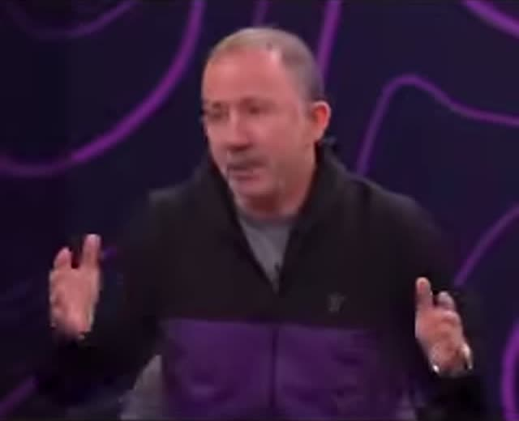

- **Video:** https://youtube.com/shorts/W2HV89vo5-A
- **Seçilen kare:** 4.0 sn · Delivering 'Biz de kendi çapımızda birileriyiz' with both hands spread in the self-assured shrug; letterbox bars cropped.
- **Kaynak:** TV interview of a Turkish football coach (tagged in the source as a well-known Beşiktaş figure), March 2025, answering whether he is influenced by a famous Portuguese manager.
- **Görünen:** TV studio talk-show clip with a purple backdrop. A Turkish football coach in a black-and-purple zip jacket sits and gestures with both hands while answering a question about whether he is influenced by a world-famous foreign manager. He says calmly, a bit offended but self-assured, with shrugging hand gestures: "Sen diyorsun ya [famous coach] böyle biri... Canım, biz de birileriyiz yani. Biz de kendi çapımızda birileriyiz Türkiye'de. O da benden etkilenir."
- **İnternetteki anlamı:** 'We are somebody too (in our own league).' Humble-brag / wounded pride reaction when someone is compared to or overshadowed by a more famous person; used jokingly to insist ordinary people matter too.
- **Güven:** high · The famous manager's name from the original line is deliberately omitted from the action (no real people). The flashy stranger stands in for the 'famous person' comparison.
- **Director eylemi:** A neighbor points admiringly at a flashy stranger in a shiny suit strolling past. The mustached cockroach frowns, slightly offended, puts a hand on his chest, then spreads his hands and says in Turkish, calm but proud: "Canım, biz de birileriyiz yani. Biz de kendi çapımızda birileriyiz!"
- **Araştırma kaynakları:** https://youtube.com/shorts/W2HV89vo5-A, https://x.com/kapitanosport/status/1896655942185533627, https://x.com/brightlikevenus/status/1953889267006288206, https://www.tiktok.com/discover/sen-diyorsun-ya-mourinho-b%C3%B6yle-biri-bizde-birileriyiz

## v25 · Beni ilgilendirmiyor hanımefendi

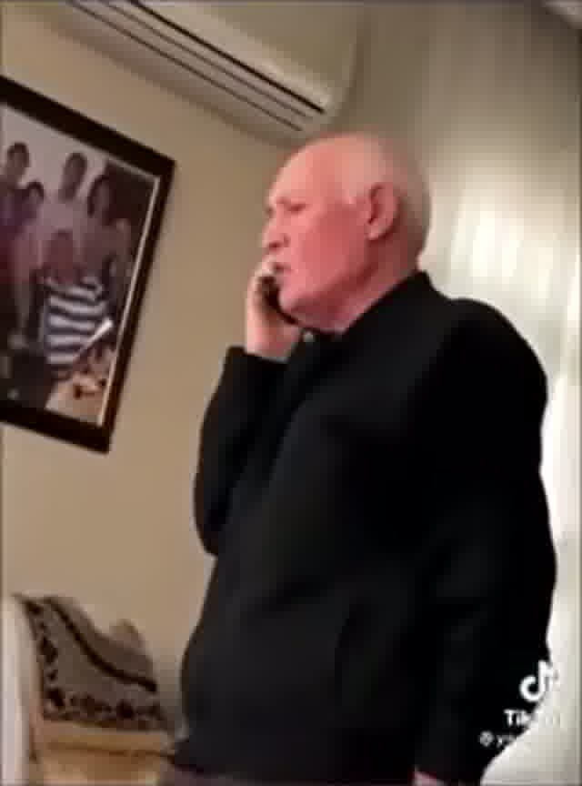

- **Video:** https://youtube.com/shorts/eWV2RvsK8r8
- **Seçilen kare:** 5.0 sn · Phone at his ear, stern flat face mid 'Beni ilgilendirmiyor hanımefendi'; top/bottom bars cropped, TikTok mark only at the lower edge off his face.
- **Kaynak:** Viral family home video (TikTok, circulating since about early 2022).
- **Görünen:** Home video in a living room (air conditioner, framed family photo, sofa). An elderly bald man in a black sweater stands holding a mobile phone to his ear, talking to a woman on the line (apparently an unwanted caller). With a stern, flat, completely unimpressed voice he repeats: "Beni ilgilendirmiyor. Beni ilgilendirmiyor hanımefendi, beni ilgilendirmiyor." Then he lowers the phone, looks at the screen and presses to hang up.
- **İnternetteki anlamı:** 'It does not concern me, madam.' Dismissive reaction to anything you do not care about: unwanted calls, gossip, other people's drama, problems that are 'not my business'.
- **Güven:** high · The caller's identity (call center, bank etc.) is not audible in the clip; 'unwanted caller' is an interpretation.
- **Director eylemi:** His mobile phone rings; he answers it and listens to a chattering woman's voice. His face goes flat and stern and he repeats in Turkish, slow and utterly unimpressed: "Beni ilgilendirmiyor. Beni ilgilendirmiyor hanımefendi, beni ilgilendirmiyor." Then he lowers the phone, frowns at the screen and jabs the button to hang up.
- **Araştırma kaynakları:** https://youtube.com/shorts/eWV2RvsK8r8, https://www.youtube.com/shorts/jkuD3L-CS1A, https://x.com/videotayfa/status/1686726997244891136, https://www.tiktok.com/discover/beni-ilgilendirmiyor-han%C4%B1mefendi-orijinal-vid

## v26 · Alacaksan al beni

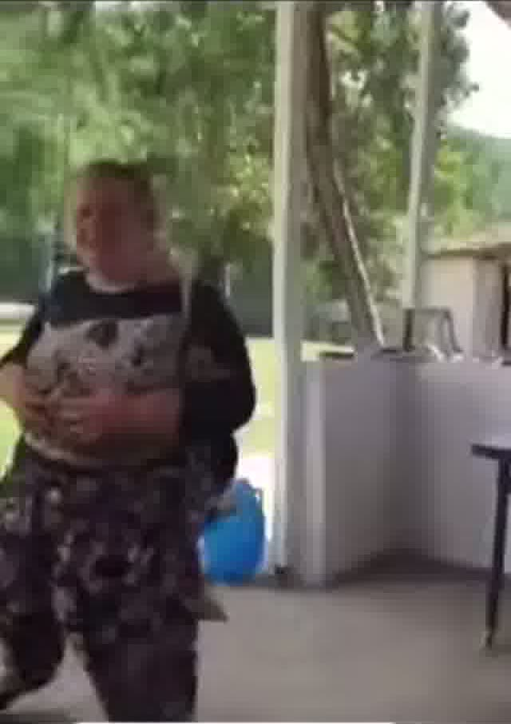

- **Video:** https://youtube.com/shorts/epP0pGev1nQ
- **Seçilen kare:** 21.0 sn · Clearest shot of the woman on the rope swing, hands folded on her belly and a cheeky smile at the camera while singing her mani; the 'Alacaksan al beni' part (0-10 s) has only blurry or cut-off frames. Letterbox cropped.
- **Kaynak:** Viral amateur village video, the 'salıncaktaki kadın/teyze' (shared by regional pages such as Konya, credited to its owner); the line is a traditional mani/türkü phrase, later also in a 2023 folk-pop song 'Bahçeye gel bahçeye (Alacaksan al beni)'.
- **Görünen:** Summer village setting: a covered concrete porch with blue plastic barrels, a table, trees and parked cars behind. A cheerful plump middle-aged village woman in floral şalvar and a patterned top sits on a rope swing hanging from the porch beam, swinging back and forth with hands on her belly, smiling cheekily at the camera and singing a folk mani in a playful, flirty voice: "Alacaksan al beni, sonra pişman olursun" (twice), then "Ay gelir aydın beni, çay gelir çaydın beni..." People off camera laugh.
- **İnternetteki anlamı:** 'If you are going to take (marry) me, take me now, or you will regret it later.' Playful, confident self-promotion: used when offering yourself for something (a date, a job, a team) or teasing someone to decide quickly.
- **Güven:** high · Dilanur's items 26 and 27 share this URL; the clip contains 'Alacaksan al beni, sonra pişman olursun', not 'her gün de karşıma çıkıyorsun' (see 27). In the original a woman sings it; here the lead man plays her role for comedy.
- **Director eylemi:** A rope swing hangs from a wooden beam by the corner shop. He plops onto it, swings back and forth with both hands folded on his belly, bats his eyelashes coyly and sings a folk tune in Turkish, playful and flirty: "Alacaksan al beni, sonra pişman olursun!" while neighbors laugh.
- **Araştırma kaynakları:** https://youtube.com/shorts/epP0pGev1nQ, https://www.facebook.com/Konya/videos/alacaksan-al-beni-sonra-pi%C5%9Fman-olursunvideo-sahibi-men%C5%9Fure-acao%C4%9Flu/1213956412497343/, https://www.tiktok.com/discover/sal%C4%B1ncaktaki-teyze-alacaksan-al-beni, https://www.shazam.com/song/1701038493/bah%C3%A7eye-gel-bah%C3%A7eye-alacaksan-al-beni?tab=lyrics

## v27 · Her gün de karşıma çıkıyorsun

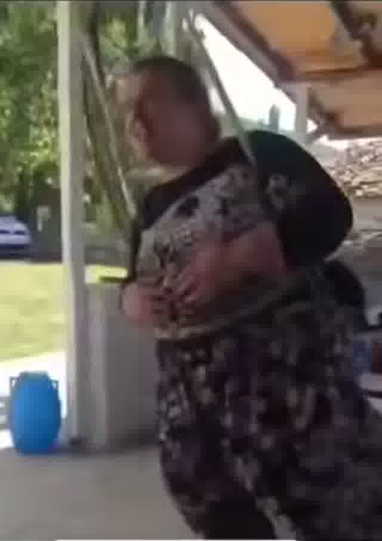

- **Video:** https://youtube.com/shorts/epP0pGev1nQ
- **Seçilen kare:** 11.0 sn · Frame taken from meme 26's clip (27's phrase is not in it): no exasperated reaction exists in this cheerful clip, so this is the sharpest close-up of the clip's main subject, the woman on the swing looking at the camera. Letterbox cropped.
- **Kaynak:** Unknown original; a TikTok sound 'Yine mi sen lan her gün de karşıma çıkıyosun' that spread in March 2025. Some full-episode uploads of a Turkish TV drama use the phrase as a title, but no scene link was confirmed.
- **Görünen:** Not in Dilanur's URL (that clip is meme 26). From web research: a viral TikTok audio (early March 2025) where an exasperated voice says "Yine mi sen lan? Her gün de karşıma çıkıyorsun! Yeter lan!" It is reused over videos of repeatedly running into the same person, animal or thing, e.g. a park clip where the same stray cat keeps appearing in front of people, or a vlog meeting an old boss again.
- **İnternetteki anlamı:** 'You again?! You pop up in front of me every single day, enough!' Mock-annoyed reaction to constantly encountering the same person, ex, boss, animal, ad or problem; often affectionate-teasing toward friends.
- **Güven:** medium · The shared URL (epP0pGev1nQ) contains only 'Alacaksan al beni'. Wording and use confirmed from reuse clips (Whisper of FpTW4zmJX5g: 'Yine mi sen lan? Her günde karşıma... Yeter lan!') and TikTok sound titles; the original speaker/situation could not be identified (TikTok blocked from this IP). A neighbor is used as the repeated encounter; a stray cat would also fit.
- **Director eylemi:** Walking past the corner shop, he nearly bumps into the same grinning neighbor who pops out from behind the blue door. He jumps back, throws both arms up in exasperation and shouts in Turkish, fed up: "Yine mi sen lan? Her gün de karşıma çıkıyorsun! Yeter lan!"
- **Araştırma kaynakları:** https://www.tiktok.com/@gunesgul/video/7477652097824083218, https://www.youtube.com/watch?v=FpTW4zmJX5g, https://www.youtube.com/watch?v=SRsiPNu1JK0, https://www.youtube.com/watch?v=S9c4OL6zwhI, https://www.instagram.com/rabiakurtt__/reel/DG_G63gsFvl/

## v28 · İlkkan, seni hiç dinlemedim ama bence haksızsın

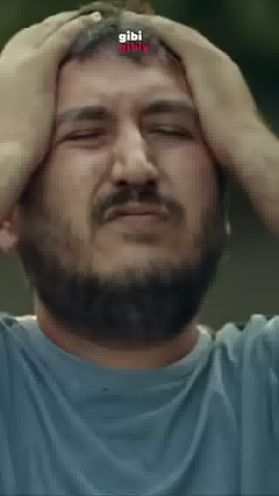

- **Video:** https://youtube.com/shorts/ubzbTlpOGSA
- **Seçilen kare:** 6.0 sn · He clutches his head with both hands, eyes squeezed shut in weary pain, right as he groans the 'seni hiç dinlemedim ama bence haksızsın' line; no subtitle burnt in.
- **Kaynak:** Turkish comedy series 'Gibi' (Exxen), season 3 episode 3; line spoken to the character İlkkan.
- **Görünen:** Close-up of a bearded man in a blue T-shirt outdoors, sitting next to a friend who has just been talking at length. He squints, grimaces as if in pain, grabs his head with both hands and says wearily, exasperated and dismissive: "İlkkan, yani seni hiç dinlemedim ama yani bence haksızsın ya... üffff. Ağzından çıkan her şey çok kötü ya." Slow, dragged-out, sighing delivery.
- **İnternetteki anlamı:** Taking a side in an argument without having listened at all; used as a reply to long rants or walls of text nobody read, or to mock people who judge without knowing the topic.
- **Güven:** high · The fictional character name 'İlkkan' was dropped from the spoken line to follow the no-character-names rule; it can be prepended to the quote if allowed. Label keeps it as Dilanur's phrase.
- **Director eylemi:** A thin friend beside the mustached cockroach talks nonstop, waving his hands. The mustached cockroach squeezes his eyes shut, grabs his head with both hands and groans in Turkish, weary and dismissive: "Yani seni hiç dinlemedim ama yani bence haksızsın ya... üff!"
- **Araştırma kaynakları:** https://www.youtube.com/shorts/ubzbTlpOGSA, https://eksisozluk.com/seni-hic-dinlemedim-ama-bence-haksizsin--7462352, https://x.com/burcuu_unlu/status/1904165948262633604, https://tenor.com/view/gibi-dinlemedim-hi%C3%A7-dinlemedim-haks%C4%B1zs%C4%B1n-y%C4%B1lmaz-gif-7475278988678664293

## v29 · Bu halıyı dokuyan çocuk kör oldu

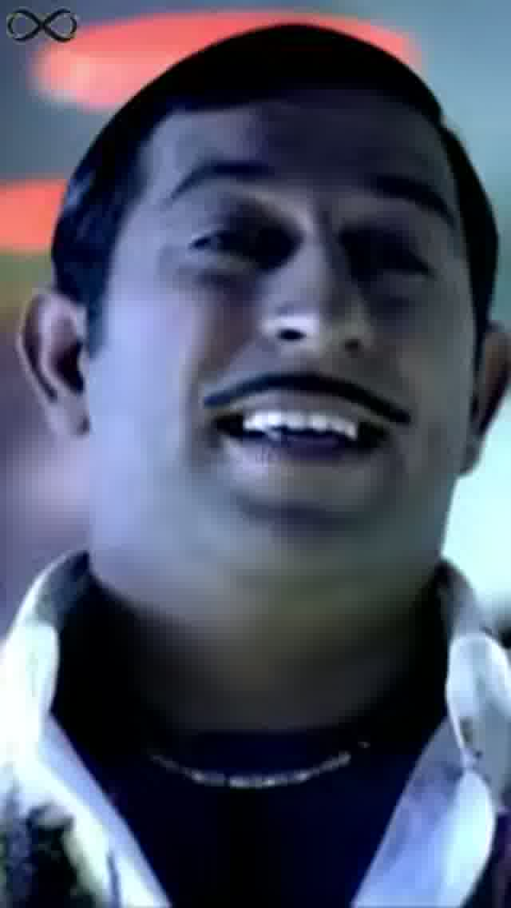

- **Video:** https://youtube.com/shorts/XkmWFTCdunI
- **Seçilen kare:** 15.67 sn · Close-up of the carpet seller's sincere, pleading salesman face as he delivers the 'bunu dokuyan çocuk kör oldu' pitch.
- **Kaynak:** Turkish sci-fi comedy film G.O.R.A. (2004), the carpet-seller hero pitching a carpet to aliens.
- **Görünen:** A mustached carpet seller in a white suit and flowery shirt, in a futuristic spaceship room watched by two stern guards in black, throws a carpet open, kneels on it, strokes the pattern and explains the motif ('eli belinde'). Then in close-up, with a sincere, pleading salesman face, he says: "Samimiyetimle söylüyorum, bunu dokuyan çocuk kör oldu ya. Fiyatı çocuğun ameliyatı dahil 5.000 dolar."
- **İnternetteki anlamı:** Mocks exaggerated sales pitches and guilt-tripping to inflate a price; used when someone oversells something ordinary or piles on a sad backstory to justify a high price.
- **Güven:** high · Original line says 'bunu dokuyan', the meme title says 'bu halıyı dokuyan'; action uses the film wording.
- **Director eylemi:** The mustached cockroach flings open a colorful patterned carpet on the street, kneels on it and lovingly strokes the pattern in front of a doubtful customer in a dark suit. He looks up with a sincere, pleading salesman face and says in Turkish: "Samimiyetimle söylüyorum, bunu dokuyan çocuk kör oldu ya!"
- **Araştırma kaynakları:** https://youtube.com/shorts/XkmWFTCdunI, https://www.youtube.com/watch?v=JoYKKjL2fFw, https://www.facebook.com/bkmonline/videos/samimiyetimle-s%C3%B6yl%C3%BCyorum-bunu-dokuyan-%C3%A7ocuk-k%C3%B6r-oldu-/2950281628400808/

## v30 · Cama ekmek banan adam

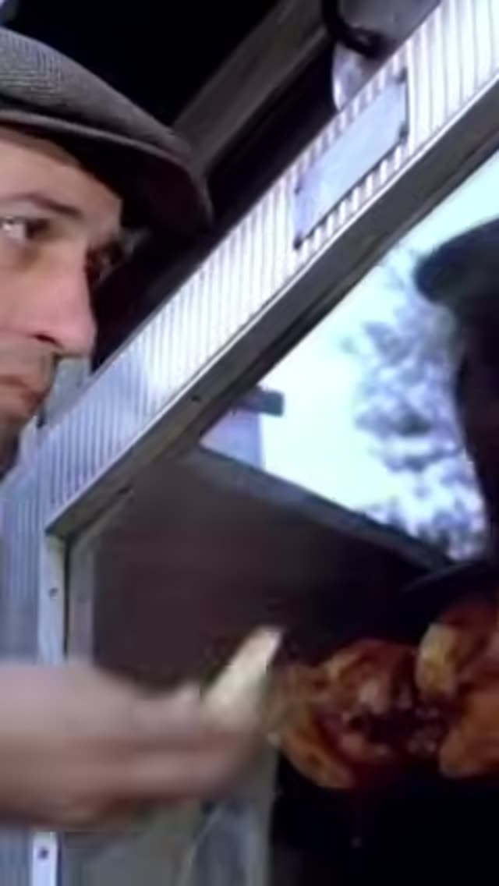

- **Video:** https://youtube.com/shorts/dortdfuvH0g
- **Seçilen kare:** 1.67 sn · The man in the flat cap holds his bread right against the shop glass next to the turning roast chickens, the exact cama ekmek banmak gesture.
- **Kaynak:** Turkish comedy film 'Tokatçı' (1983); the lead character rubs bread on a rotisserie shop window.
- **Görünen:** A poor man in a flat cap and old jacket stands outside a rotisserie chicken shop window. He holds a piece of bread against the glass right in front of the turning roast chickens, rubs it up and down on the glass as if dipping it in the chicken juices, then eats it. Silent, deadpan, hungry look; no dialogue in the clip.
- **İnternetteki anlamı:** 'Cama ekmek banmak': being so broke you can only look at what you want and imagine it; used for poverty jokes, window shopping, watching others enjoy what you cannot have.
- **Güven:** high · No spoken line in the clip, so the action has no Turkish quote. Label avoids the actor's name.
- **Director eylemi:** The corner shop window shows golden roast chickens turning on a spit. The mustached cockroach presses a piece of bread against the glass, rubs it slowly up and down over the chickens as if dipping it in their juices, then bites it with closed eyes and chews blissfully, murmuring "Mmm..."
- **Araştırma kaynakları:** https://youtube.com/shorts/dortdfuvH0g, https://www.youtube.com/watch?v=dTvbvxkfTXI, https://www.dailymotion.com/video/x19skz7

## v31 · Benim oğlum koronavirüsün ilacını bulmuştur

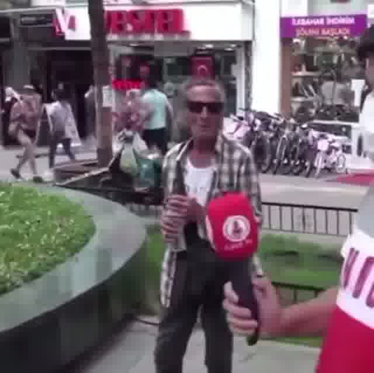

- **Video:** https://youtu.be/RBXBtGKYhrE
- **Seçilen kare:** 10.33 sn · The older man in sunglasses and plaid shirt holds the red microphone and proudly announces that his son found the coronavirus cure.
- **Kaynak:** Viral Turkish street interview (sokak röportajı) from 2020 during COVID-19.
- **Görünen:** Street interview on a shopping street during the pandemic: a reporter with a red microphone interviews a masked woman. An older man in sunglasses and a plaid shirt behind her leans in, raises his index finger and interrupts, then takes the mic and announces with total seriousness and pride: "Benim oğlum, on beş yaşındaki oğlum [name] koronavirüsün ilacını bulmuştur. Hayırlı olsun ülkemize."
- **İnternetteki anlamı:** Absurd, out-of-nowhere parental bragging; reused on TikTok/X with pets or kids ('15 yaşındaki oğlum...') to jokingly announce a proud, unbelievable achievement.
- **Güven:** high · The son's full name (a private individual) is said in the clip and is omitted from the action. Whisper heard 'ülkemizi'; context says 'ülkemize'.
- **Director eylemi:** A reporter holding a red microphone interviews a woman on the street. The mustached cockroach pushes in from behind, raises his index finger, leans into the mic and announces in Turkish, dead serious and proud: "Benim oğlum, on beş yaşındaki oğlum, koronavirüsün ilacını bulmuştur! Hayırlı olsun ülkemize!" The reporter's jaw drops.
- **Araştırma kaynakları:** https://www.youtube.com/watch?v=RBXBtGKYhrE, https://www.youtube.com/watch?v=edMC-aYD5Yw, https://x.com/doganemreilgar/status/2045060463176642879

## v32 · Yalnız penguen

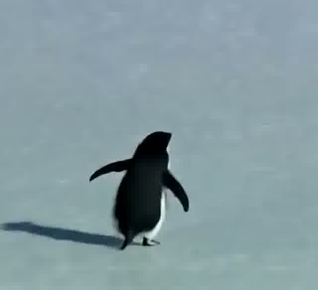

- **Video:** https://youtube.com/shorts/oO7cy7ielkM
- **Seçilen kare:** 24.0 sn · Sharpest shot of the lone penguin waddling away on the ice with flippers out; cropped to remove the bottom watermark.
- **Kaynak:** Lone penguin scene from the 2007 documentary 'Encounters at the End of the World'; Turkish dubbed/edited version circulated as a meme.
- **Görünen:** Nature documentary footage: on a vast Antarctic ice plain a single penguin waddles alone away from the colony toward distant snowy mountains. A Turkish voiceover asks: "Neden bay penguen? Neden? Neden inat ediyorsun? Herkes yaşama, okyanusa giderken sen neden o soğuk dağlara yürüyorsun? O tarafta senin için hiçbir şey yok, sadece buz ve yalnızlık var." The penguin 'answers': "Çünkü bu benim seçimim." Slow, melancholic tone.
- **İnternetteki anlamı:** Symbol of loneliness, stubbornly walking your own path, leaving everyone, quitting; used for going against the crowd or melancholic 'I choose to be alone' posts.
- **Güven:** medium · Documentary title identified via web results, not in the clip metadata. Penguins in an Istanbul street are an adaptation to keep the premise scene.
- **Director eylemi:** A group of cartoon penguins waddles happily one way down the street while the mustached cockroach waddles alone the opposite way, arms stiff at his sides like flippers. A calm voice asks in Turkish: "Neden bay penguen, neden inat ediyorsun?" Without looking back he answers, solemn and determined: "Çünkü bu benim seçimim."
- **Araştırma kaynakları:** https://youtube.com/shorts/oO7cy7ielkM, https://www.tiktok.com/discover/doktor-ainslie-pinguin-teorisi-t%C3%BCrk%C3%A7e

## v33 · Bonibon yiyen fare

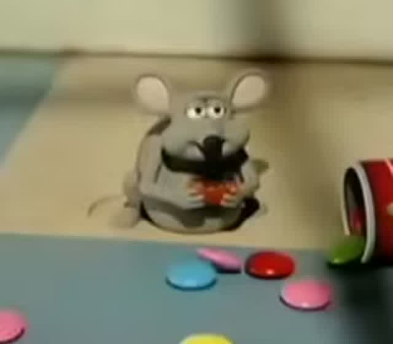

- **Video:** https://youtube.com/shorts/l8_Gv2_jlLk
- **Seçilen kare:** 3.33 sn · The clay mouse sits wide-eyed clutching a big red candy with the spilled candy tube and colorful buttons around it; cropped to drop the app logo and blurred wall.
- **Kaynak:** Clay animation clip known online as 'Mouse is eating M&M's'; original creator unknown.
- **Görünen:** Clay stop-motion: a small gray mouse sits upright on a floor next to a tipped-over candy tube with colorful candy-coated chocolate buttons scattered around. It holds a big red candy with both paws and nibbles it fast, eyes wide and darting. No speech, only sound/music.
- **İnternetteki anlamı:** Relatable image of sitting alone happily munching snacks; TikTok sound 'Tek başına bonibon yiyen fare' is used for being alone, content or melancholic, eating snacks by yourself.
- **Güven:** medium · No spoken line; exact audio track not identified. 'Bonibon' is a brand name so the action says candy-coated chocolate buttons.
- **Director eylemi:** Colorful candy-coated chocolate buttons spill from a tipped-over candy tube onto the wooden table. The mustached cockroach and a small gray clay mouse sit side by side, each holding one big red candy with both hands, nibbling it super fast with crunching sounds, cheeks puffed and eyes wide, glancing around suspiciously.
- **Araştırma kaynakları:** https://youtube.com/shorts/l8_Gv2_jlLk, https://www.youtube.com/watch?v=aikPBF887z8, https://www.tiktok.com/discover/bonibon-yiyen-fare-animasyonu

## p01 · Mavi evdeki fare

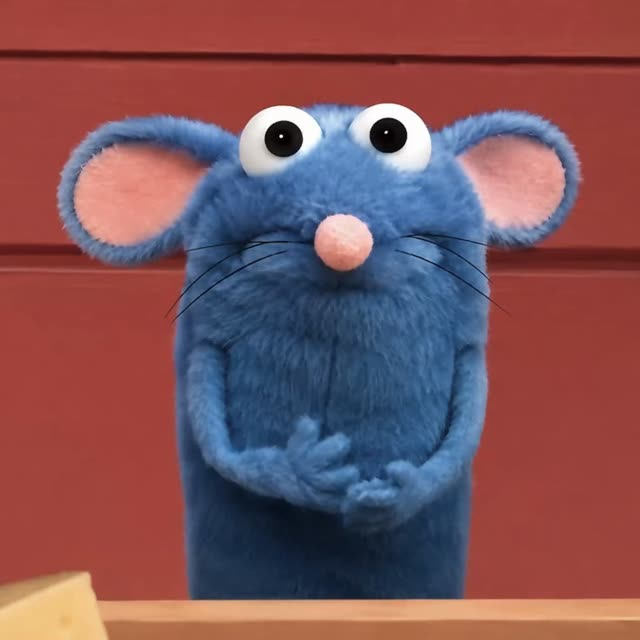

- **Dosya:** Ratón de el Oso y la casa azul
- **Kaynak:** Tutter, the mouse from the children's puppet series 'Bear in the Big Blue House' (Spanish: 'El Oso en la Casa Azul'); this still looks like a 3D/AI-rendered remake of the puppet. Exact source of this specific image not identified.
- **Görünen:** Close-up of a fluffy blue puppet-style mouse (rendered like a glossy 3D/AI remake) with big pink ears, huge round eyes and a pink nose, standing behind a wooden counter against a red plank wall; hands clasped at its belly, lips pressed together, eyes glancing sideways and up with an awkward, innocent, slightly guilty look.
- **İnternetteki anlamı:** Reaction image for acting innocent or awkward: 'ben bir şey yapmadım' looks after a small mischief, shy/sheepish waiting, or pretending not to know. Circulates mainly in Spanish-language and international TikTok/Pinterest meme pages, less as a Turkish-specific meme.
- **Güven:** medium · Character identified with high confidence; the specific 'innocent clasped hands' usage is inferred from the image and Spanish meme pages, not documented on Know Your Meme. Mouse described generically, character name not used in action.
- **Director eylemi:** A small fluffy blue cartoon mouse with big pink ears hops onto the wooden table beside the mustached cockroach. Both clasp their hands together at their bellies, press their lips shut and slowly glance sideways and up with huge, innocent eyes, as if pretending they did nothing wrong.
- **Araştırma kaynakları:** https://www.instagram.com/_cakeliz_/reel/C9xy9RrSu5A/, https://www.tiktok.com/discover/raton-azul-meme?lang=es, https://www.tiktok.com/discover/tutter-mouse-meme?lang=en, https://en.wikipedia.org/wiki/Bear_in_the_Big_Blue_House

## p02 · Ağlayan şef

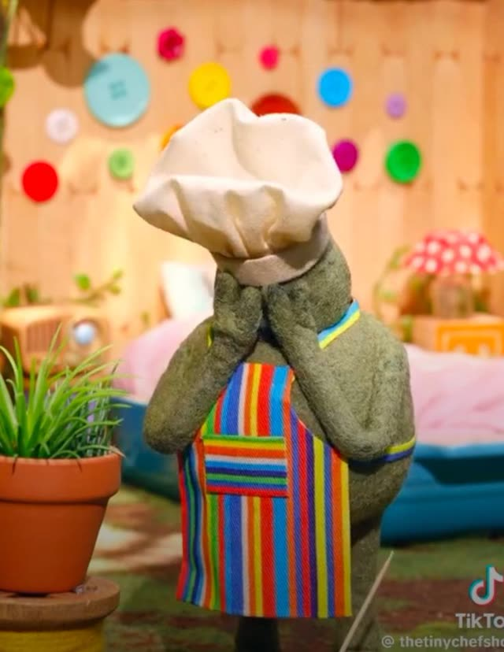

- **Dosya:** ağlayan şef
- **Kaynak:** Stop-motion children's series 'The Tiny Chef Show' (Nickelodeon); the crying clip went viral in June 2025 after the show's cancellation (the chef answers a phone call from the network, then breaks down in tears).
- **Görünen:** Small green felt stop-motion puppet in a tall white chef's hat and a rainbow-striped apron, standing in a cozy miniature room (wooden wall with button decorations, potted plant, mushroom lamp), covering its face with both hands and crying. TikTok watermark bottom right.
- **İnternetteki anlamı:** Used for heartbreak and disappointment: when something you love is cancelled or taken away, bad news arrives, or as an over-dramatic 'I'm devastated' reaction; also 'SaveTinyChef' sympathy posts.
- **Güven:** high · Phone-call setup mirrors the viral clip and can be dropped if timing is tight. Watermark in the source image; the character and show are not named in the action.
- **Director eylemi:** The mustached cockroach, wearing a tall white chef's hat and a plain white apron over his vest, hangs up a small phone at the wooden table. His lip trembles, then he buries his face in both hands and sobs loudly, shoulders shaking, while big cartoon tears drip through his fingers.
- **Araştırma kaynakları:** https://tenor.com/view/tiny-chef-crying-tiny-chef-sad-tiny-chef-i-love-you-omg-gif-3444917374609781628, https://www.tiktok.com/discover/tiny-chef-crying-meme, https://en.wikipedia.org/wiki/The_Tiny_Chef_Show, https://www.insidermemes.com/memes/template/tiny-chef-sad

## p03 · Balkona bayrak asan abi

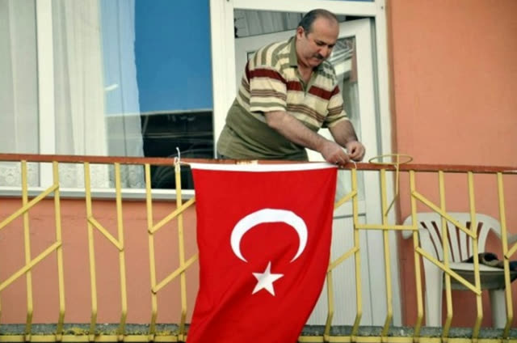

- **Dosya:** balkona türk bayrağı asan abi
- **Kaynak:** News photo taken 16 June 2013 in Dursunbey, Balıkesir, after a political call to hang flags on balconies; became a Turkish 'caps' phenomenon known as 'bayrak asan amca/dayı' with countless Photoshop edits.
- **Görünen:** Middle-aged man with a moustache in a striped polo shirt leans over a yellow-painted metal balcony railing of an apartment with salmon-pink walls, carefully tying a large red Turkish flag (white crescent and star) to the railing; plastic chair beside him, serious, focused expression.
- **İnternetteki anlamı:** Turkish Photoshop meme template: the man and his flag are edited into other scenes, or the flag is swapped for something else (a team scarf, a TV-show banner, laundry) to joke about showing loyalty or making a public statement from your balcony.
- **Güven:** high · Real person identified in news reports; not named in label or action. Photo originated in a political context; the action keeps it to the neutral flag-hanging gesture.
- **Director eylemi:** The mustached cockroach steps out onto a small balcony above the corner shop and leans over the yellow railing, carefully tying the Turkish flag, red with a white crescent and star, to it; he handles it with great respect and it never touches the ground. He smooths the flag with both hands, then stands up straight and gives a proud, serious little nod.
- **Araştırma kaynakları:** https://eksisozluk.com/balkona-bayrak-asan-adam--5080728, https://www.hurriyet.com.tr/gundem/ve-balkondaki-bayrak-asan-dayi-konustu-40122468, https://onedio.com/haber/kacin-sahibi-geldi-bayrak-asan-dayi-nin-kim-oldugu-nihayet-belli-oldu-718496, https://www.diken.com.tr/bayrak-asan-amca-behcet-hastasiymis-fotograflarini-cogunlukla-goremiyor/

## p04 · Debug çözen yazılımcı

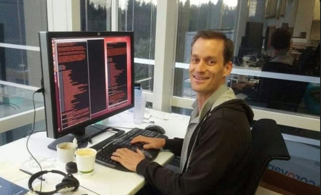

- **Dosya:** bilgisayar başında debug çözen yazılımcı
- **Kaynak:** unknown (a candid office photo circulating in programmer humor; original source not identified)
- **Görünen:** Man in a dark hoodie sitting at an office desk, hands on the keyboard, turned toward the camera with a big relaxed smile; a large monitor behind him shows a terminal full of red/orange log and code text; coffee cups, headphones and glass office windows around.
- **İnternetteki anlamı:** Used as the 'happy programmer' image: the smug, relieved face after finally fixing a bug, or ironic calm while the screen is full of errors ('everything is fine', 'bende çalışıyor').
- **Güven:** low · Exact meme source not found; meaning based on the image and Dilanur's name. The spoken line 'Çalışıyor!' is invented for readability, not a known quote; drop it if only known lines are allowed.
- **Director eylemi:** The mustached cockroach sits at the wooden table typing fast on a keyboard in front of a big monitor full of glowing lines of code, a paper coffee cup beside him. He hits one final key, then swivels around to the camera with a huge, satisfied grin and says proudly in Turkish: "Çalışıyor!"
- **Araştırma kaynakları:** https://programmerhumor.io/debugging-memes/just-keep-smiling/, https://programmerhumor.io/programming-memes/everything-is-fine/, https://trending.knowyourmeme.com/editorials/collections/26-programming-memes-to-debug-your-mind

## p05 · Birbirini gösteren kahramanlar

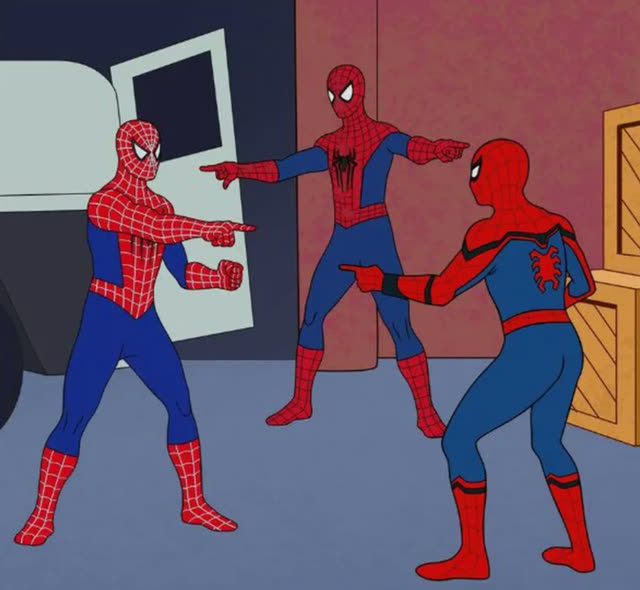

- **Dosya:** birbirini gösteren spiderman
- **Kaynak:** Two-person version comes from the 1967 animated series episode 'Double Identity', where a criminal impersonates the hero and the two point at each other; first used as a meme on Sharenator in 2011. This three-way variant is a later fan-made redraw that adds a third suit.
- **Görünen:** Flat 1960s-style cartoon still: three figures in near-identical red-and-blue full-body superhero suits and masks stand in a triangle in a warehouse by a parked truck and wooden crates, each leaning forward and pointing an outstretched finger at the others, accusing each other of being the impostor.
- **İnternetteki anlamı:** Two or more people/things that are exactly alike meet or catch each other: lookalikes, copying each other, accusing someone of what you do yourself ('pot calling the kettle black'). In Turkish use: 'aynı tas aynı hamam', two people blaming each other, identical products/teams/posts.
- **Güven:** high · Never name the hero in prompt or label; costumes stay generic (no chest emblem). The triangle of pointing arms is the recognisable part.
- **Director eylemi:** Two cockroaches in identical red-and-blue full-body superhero suits and masks drop down beside the mustached cockroach. All three freeze in a triangle, lean forward and jab stiff outstretched fingers at each other, eyes wide in shock, each accusing the others of being the copy.
- **Araştırma kaynakları:** https://knowyourmeme.com/memes/spider-man-pointing-at-spider-man, https://screenrant.com/spider-man-pointing-meme-cartoon-origin/, https://gamerant.com/spider-man-pointing-meme-origins/

## p06 · Ciddi kedi

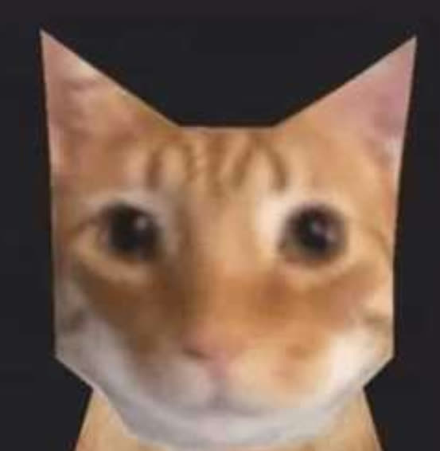

- **Dosya:** ciddi kedi
- **Kaynak:** unknown; the cutout head looks like a crop of a ginger cat staring photo (possibly the Instagram 'Staring Cat / Gusic', 2018), and the Turkish name echoes the older 'Serious Cat is serious' / 'Ciddi kedi ciddidir' meme.
- **Görünen:** Close-up of an orange tabby cat's head cut out with sharp polygon edges and pasted on a black background; the cat stares straight into the camera with wide round dark eyes and a totally blank, serious, unblinking face.
- **İnternetteki anlamı:** Deadpan reaction: 'I am dead serious' or silent, judging stare after a ridiculous message, a bad joke or a weird request. Used as a no-words reply in chats and comments.
- **Güven:** medium · Exact source of this cutout could not be confirmed; meaning (deadpan serious stare) is clear from the image and the Turkish name. The stare into camera is the beat to keep.
- **Director eylemi:** An orange cartoon cat hops onto the wooden table next to the mustached cockroach. Both turn slowly toward the camera and freeze, staring dead straight ahead with huge round eyes and completely blank, serious faces, not blinking, while a leaf drifts past.
- **Araştırma kaynakları:** https://knowyourmeme.com/memes/staring-cat-gusic, https://forum.donanimhaber.com/ciddi-kedi-ciddidir-bol-bol-ciddi-kedi-montaji-var--103209393, https://tenor.com/view/cat-stare-cat-orange-cat-gif-409976776410003122

## p07 · Denizde overthink

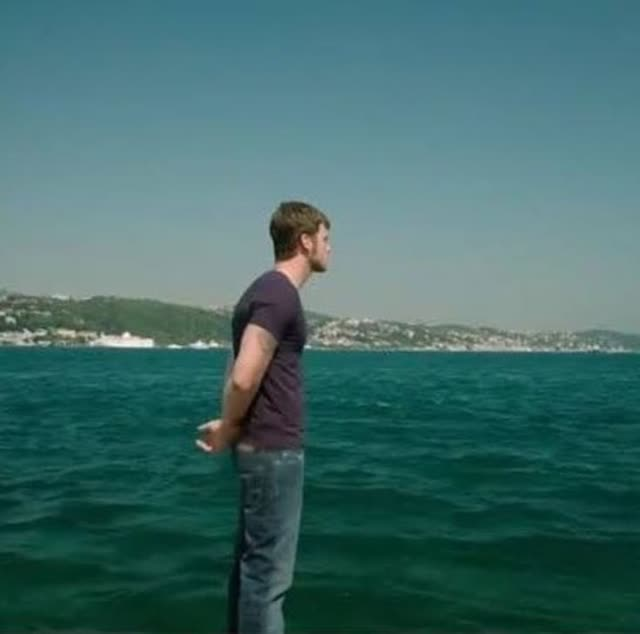

- **Dosya:** denizde overthinkleyen kuzey tekinoğlu
- **Kaynak:** Still from the Turkish TV drama 'Kuzey Güney' (2011-2013), a scene of the lead character looking out over the Bosphorus.
- **Görünen:** A man in a dark T-shirt and jeans, seen from the side, stands at the edge of the Bosphorus with his hands clasped behind his back, gazing silently at the far shore under a clear sky; calm, lost-in-thought expression.
- **İnternetteki anlamı:** 'İki gram deniz görünce gelen overthink': the deep, melancholic overthinking that hits the moment you see the sea. Used for staring at the water and brooding about life, exes or decisions, often self-ironically.
- **Güven:** high · Label avoids the character/actor name. Hands behind the back, side profile and silence are what make it readable.
- **Director eylemi:** The mustached cockroach walks to where the street opens onto a sparkling blue sea, clasps his hands behind his back and stands still, gazing at the far shore with a heavy, faraway look. The wind ruffles his vest; he lets out a long, slow sigh, lost in deep thought.
- **Araştırma kaynakları:** https://x.com/kdrtnrvrdii/status/1871236097344487830, https://www.tiktok.com/discover/deniz-g%C3%B6r%C3%BCnce-overthink, https://www.tiktok.com/discover/kuzey-tekino%C4%9Flu-deniz, https://en.wikipedia.org/wiki/Kuzey_G%C3%BCney

## p08 · Klavye başında masum bebek

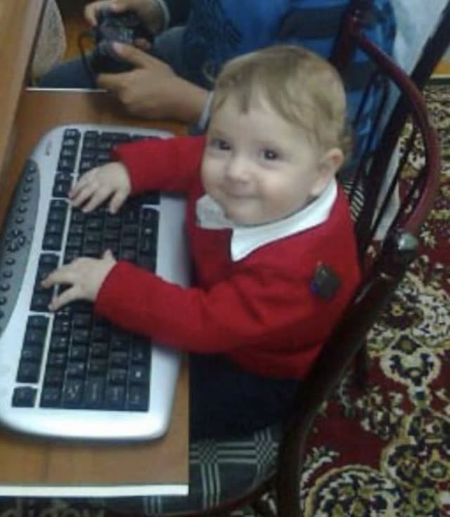

- **Dosya:** elleri kalveyde bilgisayar başında gülümseyen masum bebek
- **Kaynak:** unknown; appears to be an old family photo shared widely as a reaction image.
- **Görünen:** Top-down home photo: a baby in a red sweater with a white collar sits on a wooden chair at a desk, both little hands resting on a silver-and-black computer keyboard, turning to the camera with a sly, innocent little smile; an older child plays with a gamepad in the background, patterned carpet below.
- **İnternetteki anlamı:** Innocent face while up to something at the computer: typing a sneaky reply, pretending to work, 'I definitely didn't break anything', or proudly posting something chaotic. Used as a smug/innocent reaction.
- **Güven:** low · No documented origin or established caption found; meaning inferred from the image and Dilanur's name ('masum', innocent). The baby is a cartoon cockroach, not a human child.
- **Director eylemi:** A tiny baby cockroach in a red sweater with a white collar sits on a chair at the wooden table, both hands on a big computer keyboard. It slowly turns its head to the camera with a sly, innocent little smile, fingers still resting on the keys, while the mustached cockroach eyes it suspiciously.
- **Araştırma kaynakları:** https://www.tiktok.com/discover/baby-typing-on-computer, https://www.tiktok.com/discover/bebek-klavye-ak%C4%B1m%C4%B1

## p09 · Hava durumu

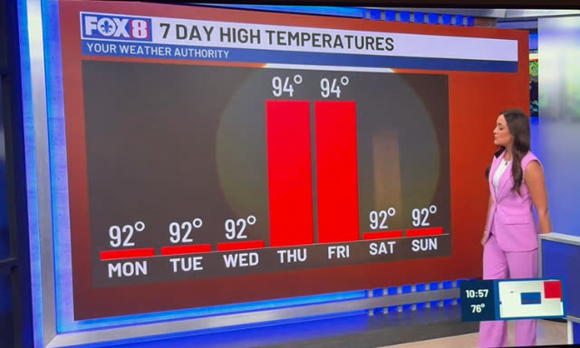

- **Dosya:** hava durumu
- **Kaynak:** FOX 8 (WVUE, New Orleans) weather broadcast; the chart's baseline sits just below 92°F so a 2-degree difference looks enormous. Featured by FlowingData on 10 July 2026 and shared widely as a bad-chart meme.
- **Görünen:** Screenshot of a US local TV weather segment: a large '7 day high temperatures' bar chart where Thursday and Friday (94°) are drawn as huge towering red bars while the other days (92°) are tiny slivers; a female weather presenter in a pink suit stands at the right looking at the board; channel branding and on-air clock visible.
- **İnternetteki anlamı:** Mockery of misleading graphs and over-dramatization: a tiny change presented as a catastrophe (truncated y-axis). Used for hyped metrics, crypto 'pumps' of 2%, marketing charts, or anyone making a big deal out of almost nothing.
- **Güven:** medium · Identification of the chart and station is solid (FlowingData post, matches FOX8 branding); how much it circulates specifically on Turkish social media is not verified. Action avoids numbers/text on the board because the premise forbids on-screen text; the joke is carried by the absurd bar heights and the 'two degrees' line.
- **Director eylemi:** A cockroach weather presenter in a pink suit stands at a giant weather board beside the mustached cockroach and dramatically points at two enormous red bars towering over tiny ones. The mustached cockroach gasps in horror, fans himself with his cap and cries in Turkish: "Aman Allahım! Yarın tam iki derece daha sıcak!" then faints onto the grass.
- **Araştırma kaynakları:** https://flowingdata.com/2026/07/10/two-degrees-looks-like-a-lot, https://knowyourmeme.com/memes/weather-forecast-fails, https://www.storytellingwithdata.com/blog/2012/09/bar-charts-must-have-zero-baseline

## p10 · Hello fellow agents

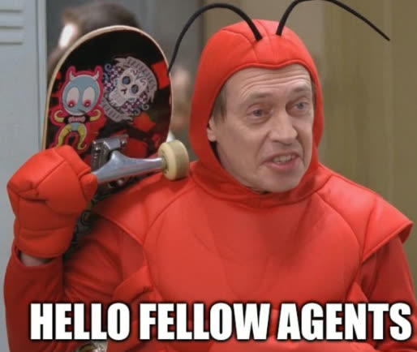

- **Dosya:** hello fellow agents
- **Kaynak:** Remix of the 'How do you do, fellow kids?' meme (30 Rock, 2012, an adult undercover among teenagers with a backwards cap and skateboard); this lobster version comes from the actor's own 2021 Halloween costume recreating the meme. The 'agents' caption plays on 2026 AI-agent culture, where the lobster emoji is an AI-agent mascot.
- **Görünen:** A middle-aged man in a full red lobster costume with long black antennae and a padded red suit, a skateboard slung over his shoulder, grins awkwardly at the camera in a school hallway with lockers; caption edited to 'HELLO FELLOW AGENTS'.
- **İnternetteki anlamı:** Someone clumsily pretending to belong to a group they obviously are not part of; here a human (or a bot) awkwardly posing as one of the AI agents, or an agent trying to blend in with humans.
- **Güven:** high · The base meme is certain; the exact origin of the 'agents' caption edit is unknown (likely AI-agent community humor). The image shows a real actor; the action describes only the costume and situation.
- **Director eylemi:** A cockroach in a bright red lobster costume with a skateboard slung over his shoulder strolls up to the mustached cockroach and a group of young cockroaches, flashes an awkward, too-wide grin and says in Turkish: "Selam millet, ben de sizden biriyim!" The young cockroaches freeze and exchange suspicious side-eyes.
- **Araştırma kaynakları:** https://knowyourmeme.com/memes/how-do-you-do-fellow-kids, https://www.rollingstone.com/tv-movies/tv-movie-news/steve-buscemi-30-rock-meme-halloween-costume-1251242/, https://metatrends.substack.com/p/the-lobster-revolution-why-247-ai, https://en.wikipedia.org/wiki/Moltbook

## p11 · Keyifli köpek

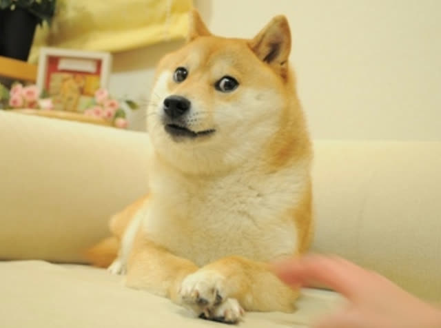

- **Dosya:** keyifli köpek
- **Kaynak:** The 2010 blog photo of a Japanese rescue Shiba Inu that became the 'Doge' meme (Know Your Meme top meme of 2013) and the face of Dogecoin; the dog died in May 2024.
- **Görünen:** A Shiba Inu dog lying on a cream sofa with crossed front paws, glancing sideways at the camera with raised eyebrow-like marks and a slight smug smile; a hand reaches in from the bottom right; cozy living room with flowers behind.
- **İnternetteki anlamı:** Smug, content, slightly suspicious side-eye; classic 'much wow, very X' internal monologue in broken English. On the Turkish internet it is known both as the Doge meme and through Dogecoin, and used for a pleased, 'keyfim yerinde' or knowing look.
- **Güven:** high · The line mixes the meme's 'much wow, very X' grammar with Turkish 'keyif' to match Dilanur's label; the plain 'Much wow.' also works if the mix sounds odd.
- **Director eylemi:** A fluffy cartoon shiba inu dog lounges on a cream sofa next to the wooden table, front paws crossed, and throws a slow, smug side-eye with raised eyebrows. The mustached cockroach sits beside it, crosses his arms the same way, copies the smug side-eye and says in a pleased hum in Turkish: "Oh, keyfim yerinde."
- **Araştırma kaynakları:** https://knowyourmeme.com/memes/doge, https://en.wikipedia.org/wiki/Kabosu_(dog), https://time.com/6981968/shiba-inu-kabosu-dies-doge-meme/, https://eksisozluk.com/doge--1219106

## p12 · Siyah takımlı gözlüklü adamlar

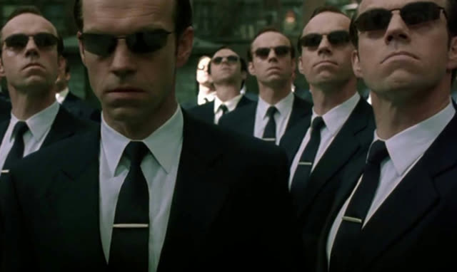

- **Dosya:** matrix siyah takım elbiseli ve gözlüklü adamlar
- **Kaynak:** The Matrix Reloaded (2003), the courtyard scene where the villain agent has copied himself into many identical clones and they watch the hero fly away.
- **Görünen:** A crowd of identical men in black suits, white shirts, thin black ties with tie clips and small dark sunglasses stand shoulder to shoulder in a courtyard, stone-faced, several looking up toward the sky.
- **İnternetteki anlamı:** Endless identical copies; used for clones, bot armies, everyone suddenly looking and acting the same, or a swarm of AI agents; the scene's line 'Me, me, me... Me too.' is used for people copying each other or piling onto a trend.
- **Güven:** high · Identification certain. The image itself is a still with no line; 'Me, me, me... Me too.' is the best-known line from the same scene. Costume described generically without naming the film or characters.
- **Director eylemi:** Dozens of identical cockroaches in black suits, thin black ties and small dark sunglasses march out of the corner shop and surround the mustached cockroach in a tight, stone-faced crowd. In perfect unison they adjust their sunglasses and say in a flat monotone in Turkish: "Ben de... ben de... ben de." The mustached cockroach looks around, sweating.
- **Araştırma kaynakları:** https://en.wikipedia.org/wiki/Agent_(The_Matrix), https://www.quotes.net/mquote/60063, https://imgflip.com/memegenerator/453123768/Matrix-Neo-vs-Agent-Smith-Clones, https://5and2guy.com/2020/10/06/me-me-meme-too/

## p13 · Metroda yorgun çocuk

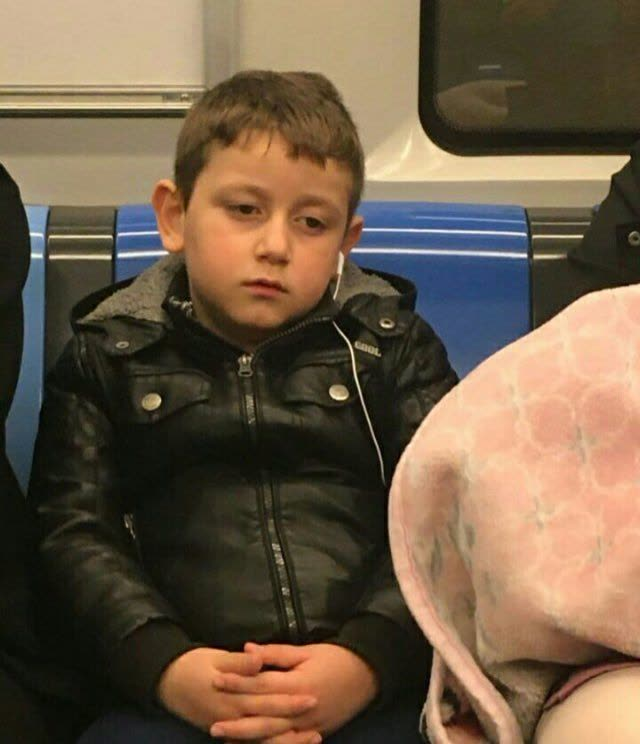

- **Dosya:** metroda seyahat eden yorgun çocuk
- **Kaynak:** Unknown; a candid metro photo that circulates on Turkish social media as a reaction image. No original poster or date could be confirmed (searches only surfaced a different 2024 viral metro video of a child holding a sibling).
- **Görünen:** Candid phone photo inside a metro/subway car: a young boy in a black leather jacket with a grey hood sits on a blue plastic seat, one white earphone in, hands clasped in his lap. He stares into space with heavy half-closed eyes, drooping cheeks and a blank, exhausted, fed-up expression; a pink blanket or bag covers the neighboring seat.
- **İnternetteki anlamı:** Total exhaustion and being done with life: used for Monday mornings, the commute home after school or work, the end of a long day, or 'I am too young for this much tiredness' jokes.
- **Güven:** low · The subject is a real, unidentified minor; the action uses a generic cockroach kid only. Meaning is inferred from the image and Dilanur's name, not from a documented meme page.
- **Director eylemi:** The mustached cockroach slumps on a bench by the wooden table next to a small cockroach kid in a puffy black jacket with one white earphone in. The kid stares blankly into nothing with heavy half-closed eyes, drooping cheeks and hands clasped in his lap, utterly drained; the mustached cockroach glances at him, sighs and slumps into the exact same tired pose.
- **Araştırma kaynakları:** https://www.sondakika.com/3-sayfa/haber-metroda-cekilen-bu-goruntu-izleyenleri-kahretti-17866685/, https://guldum.net/

## p14 · Kafasını tutan maymun

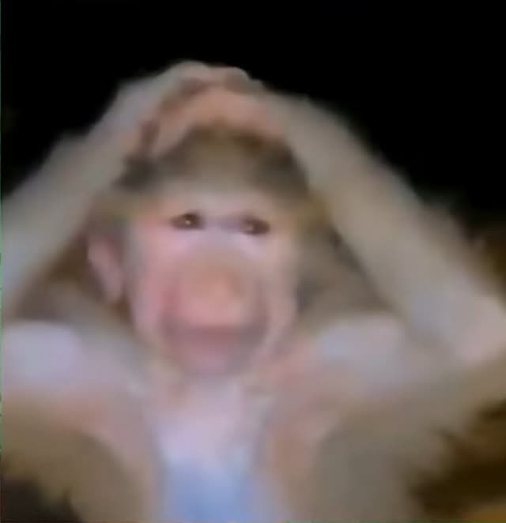

- **Dosya:** monkey
- **Kaynak:** Unknown; a widely shared reaction image/GIF and TikTok template ('monkey with hands on head'). Unrelated to the film-ape 'Oh No Monkey'.
- **Görünen:** Very blurry, low-quality close-up of a small pale-faced monkey (macaque-like) against a dark background, holding the top of its head with both hands, eyes wide and staring at the camera with a stunned, worried 'oh no' look.
- **İnternetteki anlamı:** Panic, disbelief or 'what have I done / what did I just see' moments: realizing a mistake, seeing exam results, bad news, or reacting to something absurd.
- **Güven:** medium · Dilanur named it only 'monkey'. Blurriness is part of the joke but should not be requested from the video model.
- **Director eylemi:** A small cartoon monkey sits on the wooden table next to the mustached cockroach. Both suddenly freeze, grab the tops of their heads with both hands, eyes bulging and mouths stretched in a helpless, panicked grimace, and stare straight into the camera in stunned disbelief.
- **Araştırma kaynakları:** https://www.tiktok.com/discover/monkey-with-hands-on-its-head-meme?lang=en, https://tenor.com/view/monkey-with-hands-in-the-head-gif-27591093, https://imgflip.com/memegenerator/550974154/Monkey-with-his-hands-on-head

## p15 · Muhehehe kedi

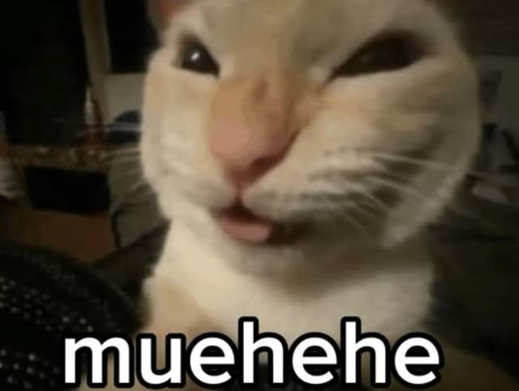

- **Dosya:** muhehehe
- **Kaynak:** Viral cat reaction GIF/TikTok meme from about 2024 ('muehehe / mwehehe cat'), widespread on Tenor and TikTok; the original owner is not confirmed.
- **Görünen:** Close-up of a white-and-cream cat pushing its face toward the camera, one eye squinted, cheeks raised in a smug grin with the tip of its pink tongue poking out; burnt-in caption 'muehehe'. Indoor home background, blurred.
- **İnternetteki anlamı:** A mischievous, evil little giggle: used after pulling a prank, getting away with something, a sneaky plan, or teasing someone.
- **Güven:** high · The image has burnt-in text; the action asks for no text and uses the giggle as audio.
- **Director eylemi:** A fluffy white cartoon cat pushes its face right up to the camera beside the mustached cockroach, squints one eye, pokes out the tip of its tongue and giggles mischievously: "Muhehehe!" The mustached cockroach leans in with the same sly squint and snickers along, rubbing his hands together.
- **Araştırma kaynakları:** https://tenor.com/view/muehehe-cat-gif-1835729522114996048, https://tenor.com/view/mwehehe-cat-cat-meme-gif-458450512574152873, https://www.tiktok.com/discover/muehehe-cat?lang=en

## p16 · Müzik dinleyen köpek

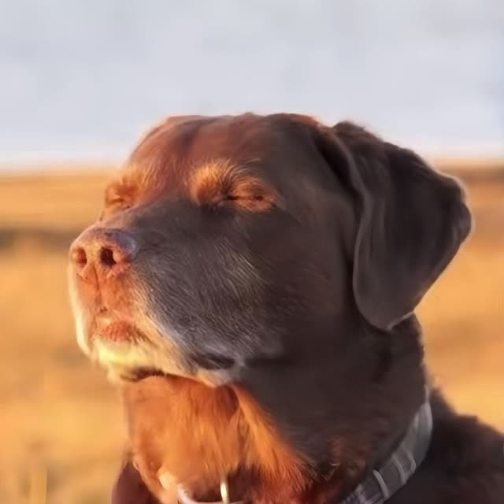

- **Dosya:** müzik dinleyen köpek
- **Kaynak:** TikTok post from November 2024 pairing this dog photo with the soul song 'Say You Love Me'; became the 'cooked dog / dog closing eyes in sunset' meme.
- **Görünen:** Close-up of an old brown Labrador-type dog outdoors in a golden field at sunset, eyes gently closed, chin lifted, calm and blissful, bathed in warm light.
- **İnternetteki anlamı:** Blissful vibing to a song, or peaceful acceptance of the inevitable ('I am cooked, and I accept it'). In Turkish use it is mostly the dog enjoying music with eyes closed.
- **Güven:** high · The song itself is copyrighted and not named in the action; 'soft soulful song' is used instead.
- **Director eylemi:** A brown cartoon dog sits beside the mustached cockroach as a soft soulful song plays. Both lift their chins into warm golden light, close their eyes and sway slowly, lips pressed in blissful calm, completely lost in the music and at peace with the world.
- **Araştırma kaynakları:** https://sg.news.yahoo.com/cooked-dog-meme-dog-closing-170000238.html, https://www.tiktok.com/discover/dog-closing-eyes-sunset, https://www.myinstants.com/en/instant/dog-closing-eyes-45003/

## p17 · Göğe bakıp no no no

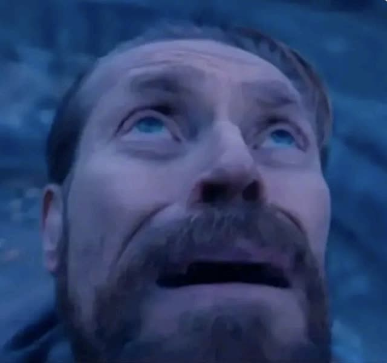

- **Dosya:** no no no
- **Kaynak:** Still from the 2018 biopic 'At Eternity's Gate' (painter looking up at the sky); spread as the 'Looking Up' reaction meme from May 2020 (iFunny), peaking late 2021.
- **Görünen:** Tight close-up of a bearded middle-aged man in cold blue light, head tilted back, staring straight up at the sky with wide pale eyes, eyebrows raised and mouth hanging open in overwhelmed awe and dread.
- **İnternetteki anlamı:** Reaction for being overwhelmed or dreading something looming above or coming next; on TikTok it is paired with a panicked 'no no no' sound to show dawning realisation that something bad is about to happen.
- **Güven:** medium · Film and 'Looking Up' meme identified with high confidence; the exact 'no no no' pairing comes from Dilanur's name and TikTok sound listings, not a documented source. Actor name kept out of label and action.
- **Director eylemi:** The mustached cockroach suddenly freezes, slowly tilts his head all the way back and stares up at the sky, eyes huge and watery, eyebrows raised, mouth hanging open in overwhelmed dread. His lip trembles as he whispers in panicked disbelief: "No no no no..."
- **Araştırma kaynakları:** https://knowyourmeme.com/memes/willem-dafoe-looking-up, https://en.meming.world/wiki/Willem_Dafoe_Looking_Up, https://dailydot.com/willem-dafoe-looking-up-meme, https://www.tiktok.com/discover/no-no-no-no-meme-sound?lang=en

## p18 · Uzanan kedi

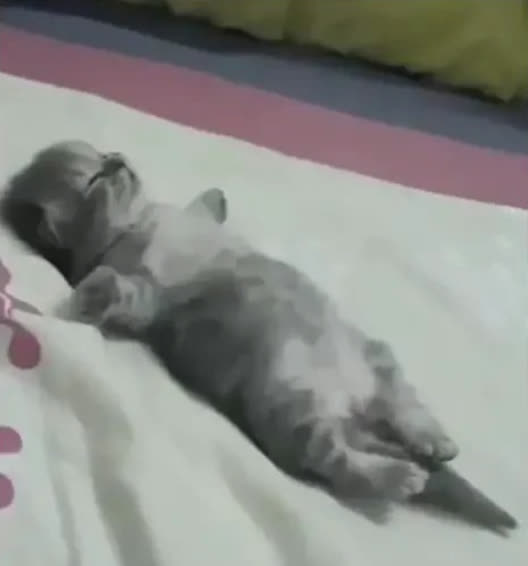

- **Dosya:** uzanan kedi
- **Kaynak:** unknown (viral pet video screenshot; creator not identified)
- **Görünen:** A small gray tabby kitten lies flat on its back on a white bed sheet, belly up, eyes closed, front paws folded on its chest and hind legs stretched out, sleeping like a human relaxing in bed.
- **İnternetteki anlamı:** 'Me after work' or weekend energy: total relaxation, laziness, lying down and doing nothing; used for exhaustion, 'yatıp uzanmak', and cute comfort posts.
- **Güven:** medium · Specific source video not found; meaning inferred from the general 'sırt üstü uyuyan kedi' genre and the image. No known spoken line, so only a sigh.
- **Director eylemi:** A tiny gray cartoon kitten lies flat on its back on the wooden table, belly up, paws folded on its chest, fast asleep. The mustached cockroach yawns hugely, lies down beside it in the exact same pose, folds his hands on his vest, closes his eyes with a blissful smile and lets out a long, contented "Ohhh..."
- **Araştırma kaynakları:** https://www.haberturk.com/sirt-ustu-uyuyan-kedi-sosyal-medyanin-gozdesi-oldu-2505459, https://eksisozluk.com/sirtustu-uyuyan-kedi--2582737, https://www.tiktok.com/discover/sleeping-cat-meme?lang=en

## p19 · Üzgün kurbağa

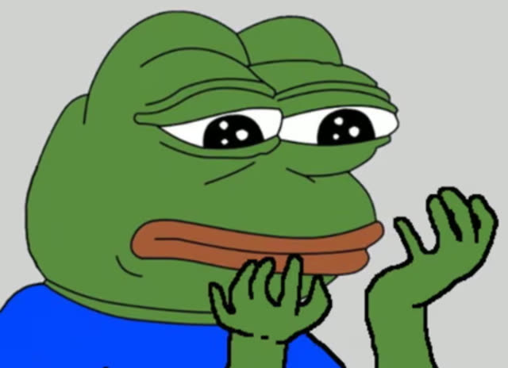

- **Dosya:** üzgün kurbağa
- **Kaynak:** Sad variant of a frog character from the comic 'Boy's Club'; 'Feels Bad Man / Sad Frog' edit appeared on 4chan in January 2009; the hands-raised pose matches the 'PepeHands' Twitch emote (2016).
- **Görünen:** Cartoon drawing of a green frog in a blue T-shirt with droopy heavy eyelids, big glossy sad eyes and a thick down-turned lip, both hands raised beside its cheeks in a gesture of despair, on a plain gray background.
- **İnternetteki anlamı:** Sadness, disappointment, failure or self-pity ('feels bad man'); posted when something goes wrong, a loss, or a relatable letdown.
- **Güven:** high · Branded character: name never used in label or action, and the signature blue T-shirt is left out of the action to avoid describing the character; recognition relies on the droopy eyes, lip and hands-raised pose.
- **Director eylemi:** A small sad green cartoon frog sits on the wooden table with droopy eyelids, big watery eyes and a heavy down-turned lip, both hands raised beside its cheeks in despair. The mustached cockroach sits next to it and copies the exact pose, lower lip trembling, eyes glistening, and lets out a long, sad sigh.
- **Araştırma kaynakları:** https://knowyourmeme.com/memes/feels-bad-man-sad-frog, https://knowyourmeme.com/memes/pepehands, https://en.wikipedia.org/wiki/Pepe_the_Frog

## p20 · Yangında gülen kız

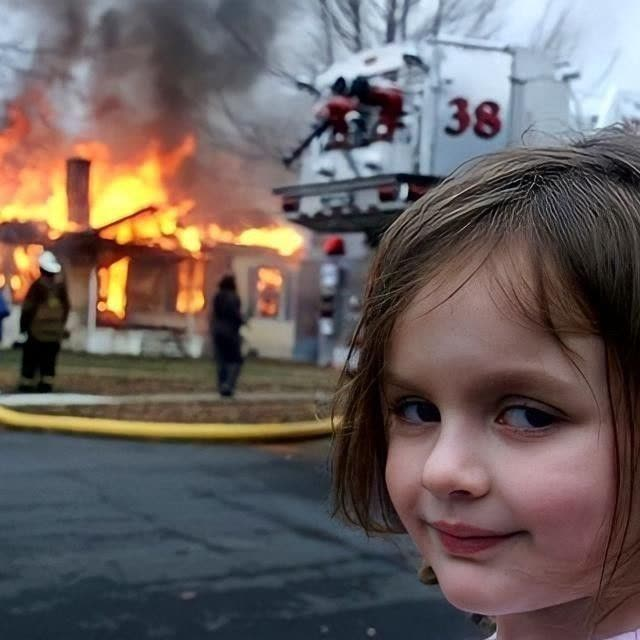

- **Dosya:** yangında arkada gülen kız
- **Kaynak:** 'Disaster Girl': photo taken by the girl's father in January 2005 at a controlled training burn by a local fire department in Mebane, North Carolina; went viral from 2008.
- **Görünen:** A small girl with messy brown hair in the foreground turns to the camera with a sly, knowing half-smile while a house burns behind her, with firefighters, a fire hose on the ground and a fire truck in the background.
- **İnternetteki anlamı:** Smug satisfaction amid chaos, as if the subject secretly caused the disaster; used for 'I did this' moments, causing drama and watching it unfold, or evil-grin satisfaction.
- **Güven:** high · A shed down the street burns instead of the corner shop so the premise street stays intact for later beats. Subject is a private person; no name used. Fire is cartoonish and nobody is hurt.
- **Director eylemi:** Behind him an old wooden shed down the street burns with big cartoon flames and smoke while firefighter cockroaches spray it with a hose. In the foreground the mustached cockroach slowly turns to the camera with a small, sly, knowing smirk and narrowed eyes, as if he started it, then blinks innocently.
- **Araştırma kaynakları:** https://knowyourmeme.com/memes/disaster-girl, https://en.wikipedia.org/wiki/Disaster_Girl, https://dailydot.com/meme-history-disaster-girl
